# Malicious Network Traffic Investigation with Brim

## Executive Summary

A network traffic investigation was conducted across three packet captures representing compromised endpoint activity.

Using **Brim**, **Zeek network logs**, **Suricata alerts**, and external threat-intelligence sources, I analyzed HTTP connections, DNS activity, suspicious domains, executable downloads, and malicious infrastructure.

The investigation identified three separate malicious activity patterns associated with:

- **Emotet**
- **RedLine Stealer**
- **Phorpiex**

The investigation demonstrates how network telemetry can be used to move from suspicious traffic to identifying affected hosts, malicious infrastructure, downloaded payloads, IDS alerts, and malware families.

> All malicious indicators in this report are defanged where appropriate.

---

## Investigation Environment

**Primary Tool:** Brim  
**Data Source:** PCAP network captures  
**Network Telemetry:** Zeek logs  
**IDS Evidence:** Suricata  
**Threat Intelligence:** URLhaus and VirusTotal  
**Protocols Investigated:** HTTP and DNS  

### Skills Demonstrated

- PCAP traffic analysis
- Zeek log analysis
- Brim query filtering
- HTTP request investigation
- DNS analysis
- IOC extraction
- Suspicious infrastructure identification
- Malicious payload identification
- Suricata alert correlation
- Threat-intelligence enrichment
- Malware attribution
- Incident documentation

---

# Infection 1 — Suspicious HTTP Activity and Malware Download

## Initial Network Triage

I began by reviewing HTTP traffic and extracting the source IP, destination IP, destination port, HTTP method, host, and URI.

Example Brim query:

```text
_path=="http" | cut id.orig_h, id.resp_h, id.resp_p, method, host, uri | uniq -c
```

The analysis identified the victim system as:

```text
192.168.75.249
```

Several external HTTP destinations were contacted by the endpoint.

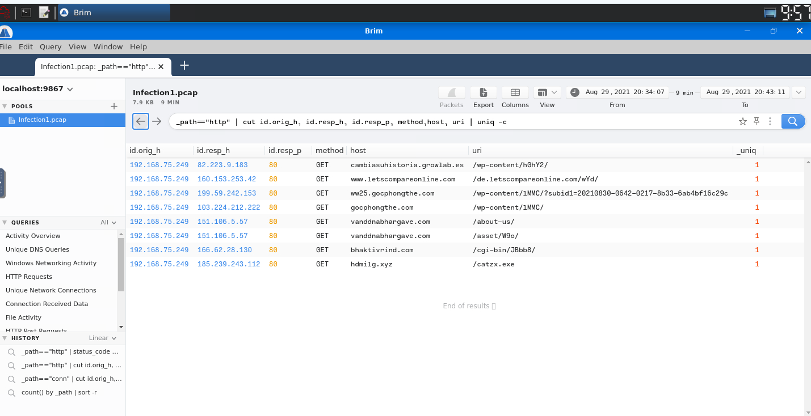

---

## Suspicious 404 Requests

I filtered the HTTP traffic for **404 Not Found** responses.

```text
_path=="http" | status_code==404
```

Two suspicious domains were identified:

```text
cambiasuhistoria[.]growlab[.]es
www[.]letscompareonline[.]com
```

Both requests originated from the compromised endpoint.

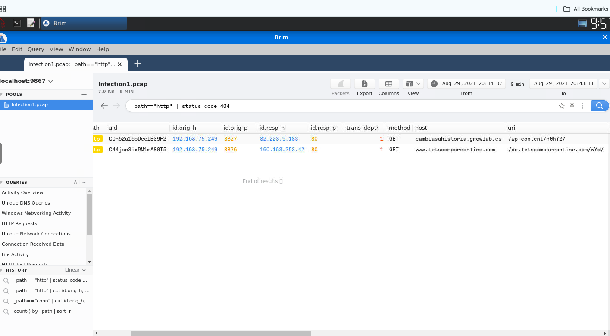

This helped reduce the dataset and identify external hosts that warranted further investigation.

---

## Successful External Connection

Further HTTP analysis identified a successful request where the HTTP response body length was **1,309 bytes**.

```text
_path=="http" | response_body_len==1309
```

The connection was made to:

```text
ww25[.]gocphongthe[.]com
199[.]59[.]242[.]153
```

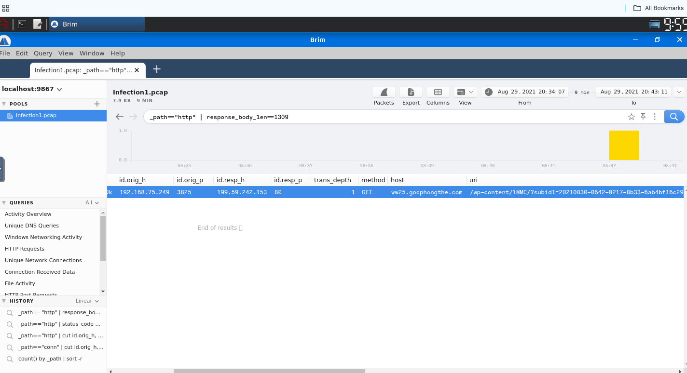

This provided another suspicious external destination associated with the compromised host.

---

## DNS Investigation

DNS activity was aggregated to identify frequently requested and suspicious domains.

```text
_path=="dns" | count() by query | sort -r
```

The domain:

```text
cab[.]myfkn[.]com
```

appeared in multiple DNS requests, including a capitalized variation.

A total of **7 requests** were associated with the domain.

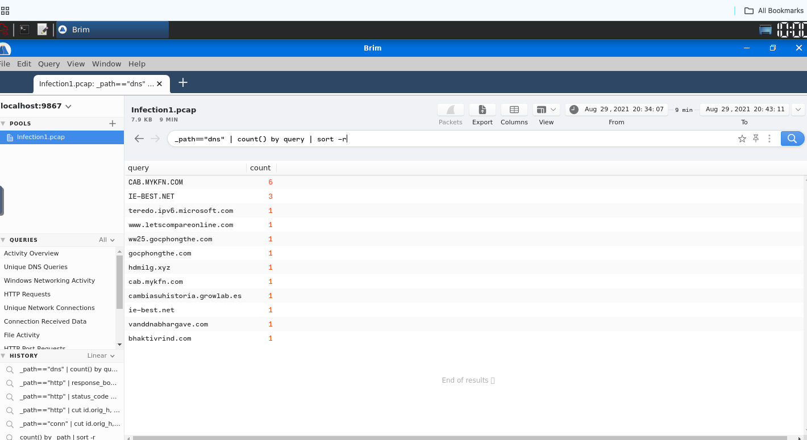

Another suspicious HTTP request was also identified to:

```text
bhaktivrind[.]com/cgi-bin/JBbb8/
```

---

## Malicious Executable Download

HTTP analysis revealed an executable being retrieved by the victim:

```text
/catzx.exe
```

The external server was:

```text
185[.]239[.]243[.]112
```

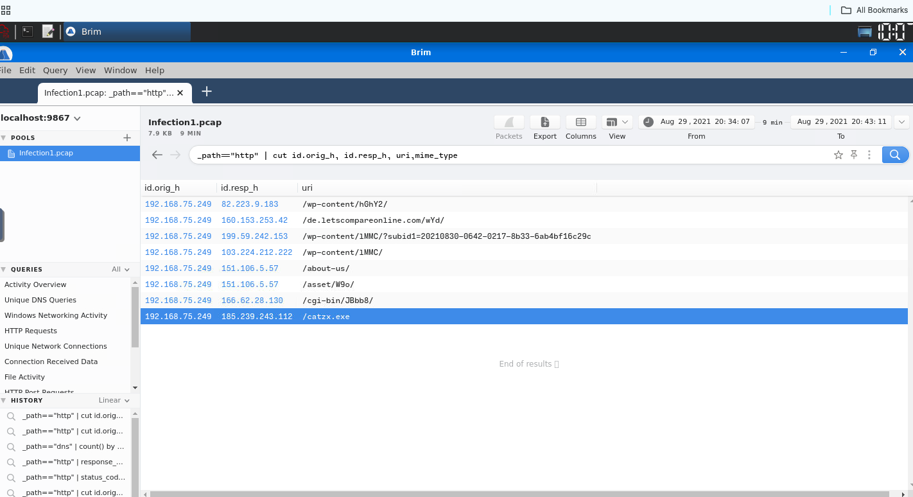

Threat-intelligence enrichment of the indicators gathered during the investigation associated the activity with **Emotet**.

### Infection 1 Assessment

The evidence shows a compromised endpoint communicating with multiple suspicious external domains before retrieving an executable from external infrastructure.

The combination of suspicious DNS activity, HTTP communication, and executable retrieval strongly supports malicious activity.

---

# Infection 2 — Suspicious POST Activity and RedLine Stealer

## Identifying the Compromised Host

Analysis of the second packet capture identified the victim as:

```text
192[.]168[.]75[.]146
```

The system made repeated HTTP POST requests to:

```text
5[.]181[.]156[.]252
```

A total of **3 POST connections** were observed.

The same compromised endpoint later contacted:

```text
hypercustom[.]top
45[.]95[.]203[.]28
```

and requested:

```text
/jollion/apines.exe
```

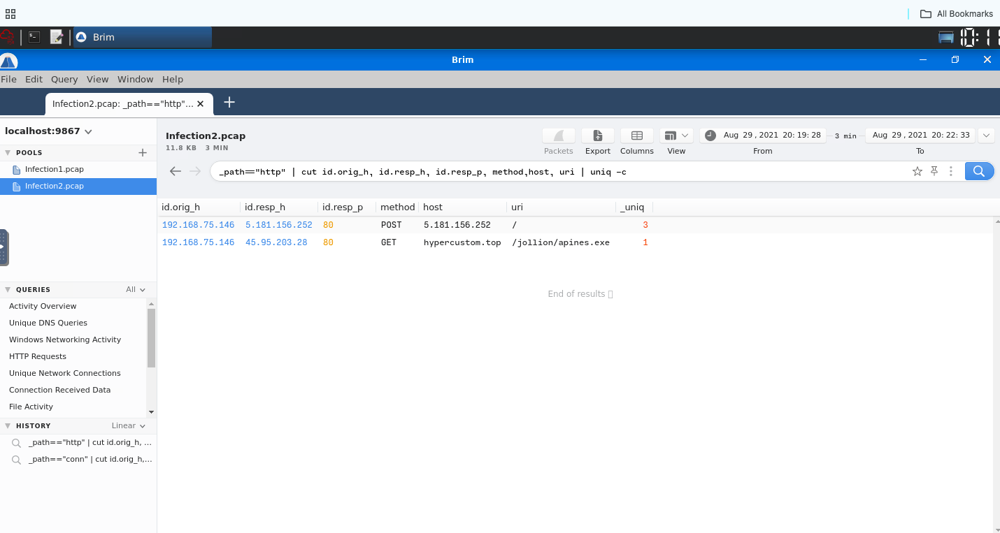

This showed repeated outbound communication followed by the retrieval of an executable.

---

## Suricata Alert Correlation

The network findings were correlated with Suricata IDS alerts.

Searching for:

```text
"A Network Trojan was detected"
```

returned two alerts involving:

```text
Source:      192[.]168[.]75[.]146
Destination: 45[.]95[.]203[.]28
Port:        80
Protocol:    HTTP
```

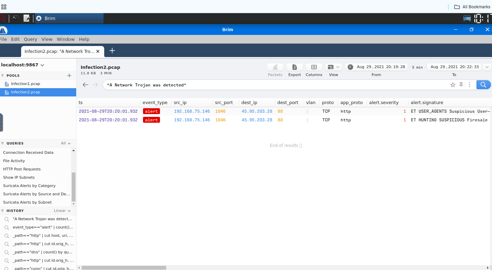

The Suricata alerts provided additional IDS evidence supporting the suspicious activity identified through the HTTP traffic.

---

## Suspicious Domain Identification

Further HTTP analysis identified:

```text
hypercustom[.]top
```

as the domain associated with the executable request.

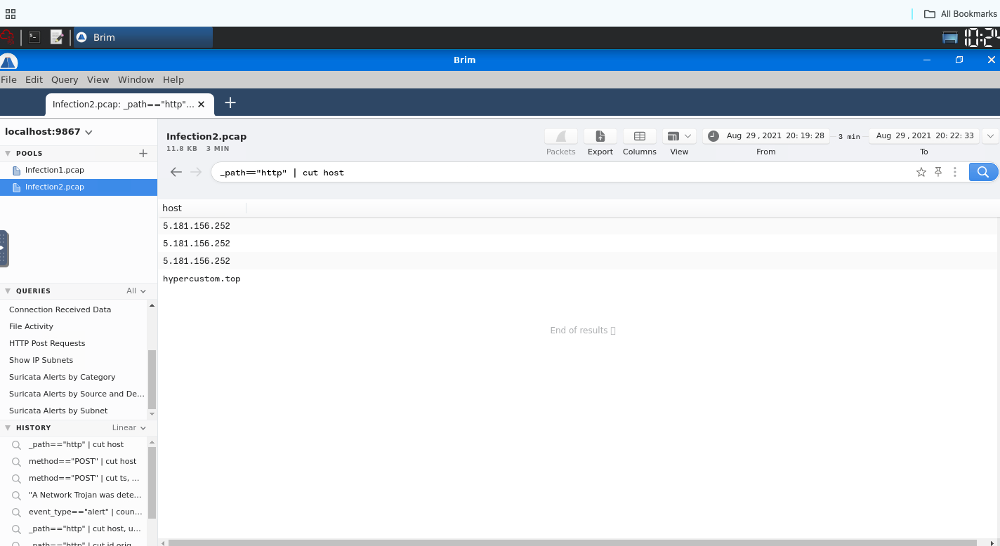

Rather than relying only on the network behavior, I used the identified domain for external threat-intelligence enrichment.

---

## URLhaus Threat-Intelligence Enrichment

The suspicious domain was investigated using **URLhaus**.

URLhaus contained records for:

```text
hypercustom[.]top/jollion/apines.exe
```

and associated the malicious infrastructure and payload with:

**RedLine Stealer**

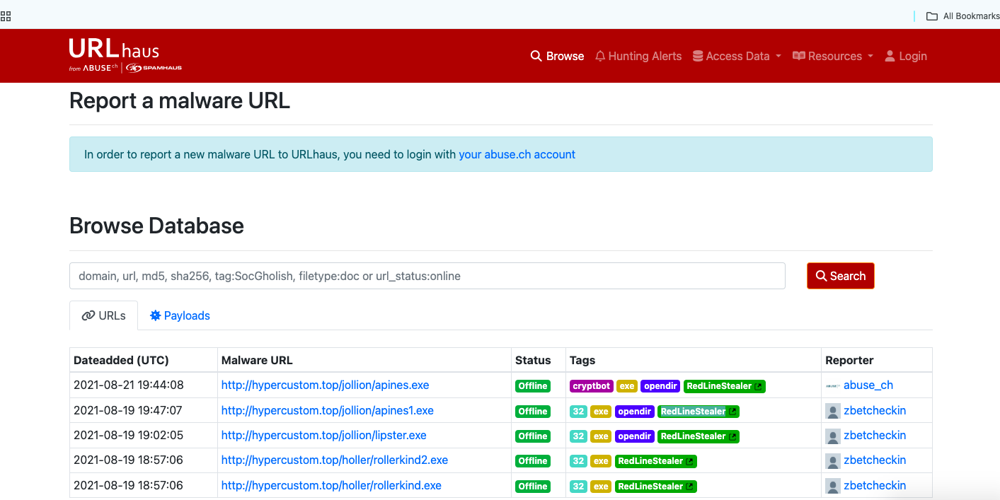

### Infection 2 Assessment

The evidence establishes the following investigation chain:

```text
Compromised Host
      ↓
Repeated HTTP POST Activity
      ↓
Suspicious External Infrastructure
      ↓
Executable Download
      ↓
Suricata Detection
      ↓
Threat-Intelligence Enrichment
      ↓
RedLine Stealer
```

This demonstrates the value of correlating network telemetry, IDS alerts, and threat-intelligence sources during a SOC investigation.

---

# Infection 3 — Multi-Domain Malware Delivery

## Suspicious Infrastructure and Payload Discovery

The third packet capture contained suspicious activity from:

```text
192[.]168[.]75[.]232
```

HTTP analysis revealed communication with three suspicious domains:

```text
efhoahegue[.]ru
afhoahegue[.]ru
xfhoahegue[.]ru
```

The associated IP addresses identified during the investigation were:

```text
162[.]217[.]98[.]146
199[.]21[.]76[.]77
63[.]251[.]106[.]25
```

The HTTP timeline also revealed repeated executable downloads.

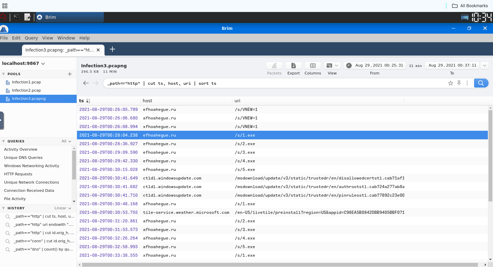

---

## DNS Infrastructure Correlation

DNS evidence was used to correlate suspicious domains with resolved IP addresses.

For example:

```text
afhoahegue[.]ru → 199[.]21[.]76[.]77
```

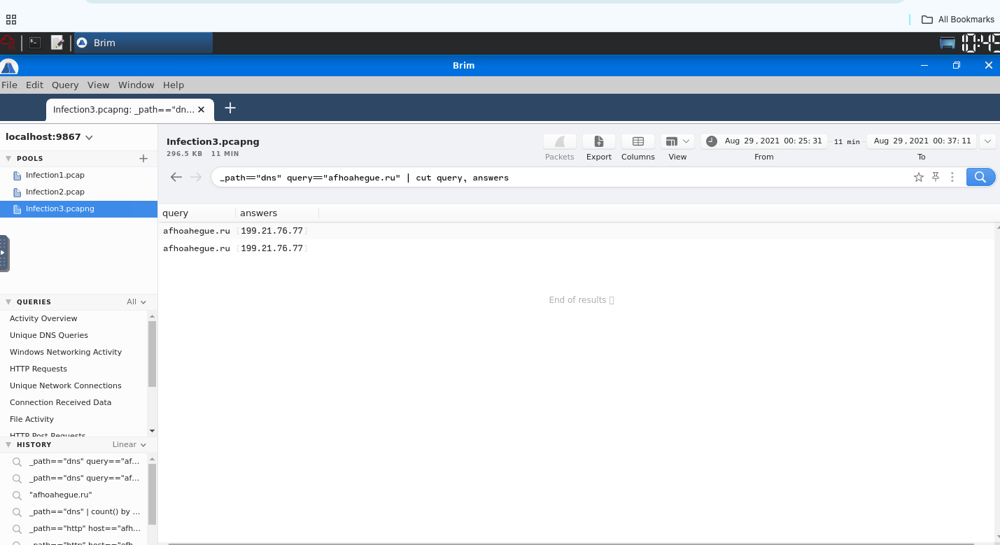

DNS-to-IP correlation provides additional infrastructure context and can help analysts pivot between domains and destination addresses during an investigation.

---

## DNS Query Frequency

I used aggregation instead of manually reviewing individual DNS events.

Example query:

```text
_path=="dns" query=="efhoahegue.ru" | count() by query
```

The result showed:

```text
2 DNS requests
```

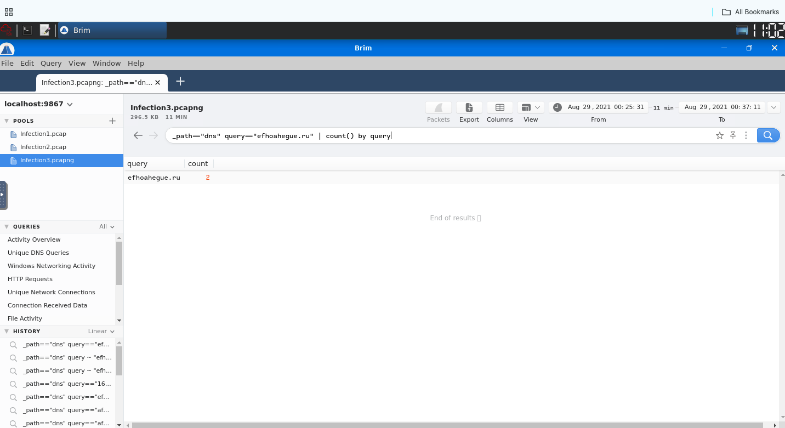

---

## Repeated Executable Downloads

The investigation identified five executable downloads from:

```text
efhoahegue[.]ru
```

Observed payload paths included:

```text
/s/1.exe
/s/2.exe
/s/3.exe
/s/4.exe
/s/5.exe
```

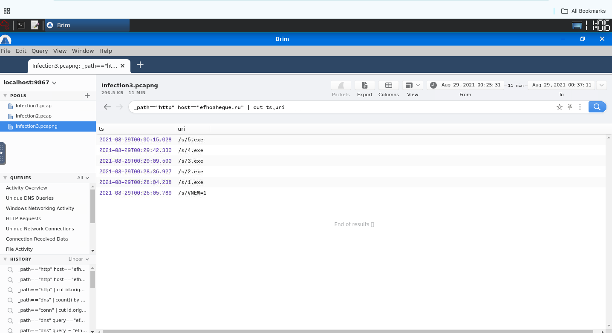

Repeated executable retrieval from suspicious infrastructure is a strong indicator of automated malware delivery or the retrieval of additional malware components.

---

## Observed Download User-Agent

The HTTP requests associated with the downloads used the following user-agent:

```text
Mozilla/5.0 (Macintosh; Intel Mac OS X 10.9; rv:25.0) Gecko/20100101 Firefox/25.0
```

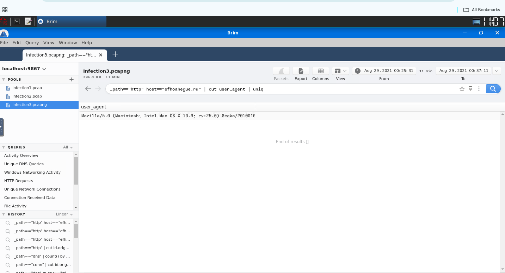

The user-agent itself is not sufficient to classify traffic as malicious, but it provides another artifact that can be used when correlating related network events.

---

## Total DNS Activity

Finally, I calculated the overall DNS activity contained within the third packet capture.

```text
_path=="dns" | count()
```

The capture contained:

```text
986 DNS events
```

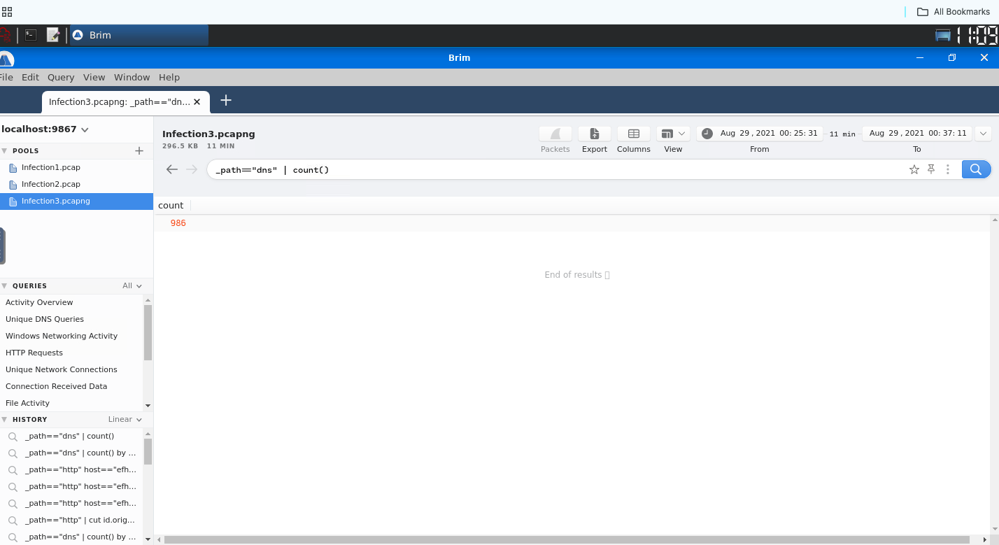

Threat-intelligence research associated the malicious activity with the **Phorpiex** malware family.

### Infection 3 Assessment

The victim communicated with several suspicious domains and downloaded multiple executable files during the observed period.

The repeated binary retrieval combined with HTTP and DNS infrastructure correlation strongly supports automated malware activity rather than normal user browsing.

---

# Indicators of Compromise

| Category | Indicator | Context |
|---|---|---|
| Host | `192[.]168[.]75[.]249` | Infection 1 victim |
| IP | `185[.]239[.]243[.]112` | Executable hosting server |
| File | `catzx.exe` | Infection 1 downloaded executable |
| Domain | `cambiasuhistoria[.]growlab[.]es` | Suspicious HTTP activity |
| Domain | `www[.]letscompareonline[.]com` | Suspicious HTTP activity |
| Domain | `cab[.]myfkn[.]com` | Suspicious DNS activity |
| Domain | `bhaktivrind[.]com` | Suspicious HTTP infrastructure |
| Host | `192[.]168[.]75[.]146` | Infection 2 victim |
| IP | `5[.]181[.]156[.]252` | Repeated HTTP POST destination |
| IP | `45[.]95[.]203[.]28` | Payload infrastructure |
| Domain | `hypercustom[.]top` | RedLine-associated infrastructure |
| File | `apines.exe` | Downloaded executable |
| Host | `192[.]168[.]75[.]232` | Infection 3 victim |
| Domain | `efhoahegue[.]ru` | Suspicious infrastructure |
| Domain | `afhoahegue[.]ru` | Suspicious infrastructure |
| Domain | `xfhoahegue[.]ru` | Suspicious infrastructure |
| IP | `162[.]217[.]98[.]146` | Infection 3 infrastructure |
| IP | `199[.]21[.]76[.]77` | Infection 3 infrastructure |
| IP | `63[.]251[.]106[.]25` | Infection 3 infrastructure |
| Files | `1.exe` – `5.exe` | Repeated executable downloads |

---

# Malware Families Identified

| Infection | Malware |
|---|---|
| Infection 1 | Emotet |
| Infection 2 | RedLine Stealer |
| Infection 3 | Phorpiex |

---

# MITRE ATT&CK Mapping

The following ATT&CK techniques are consistent with behavior directly observable in the packet captures.

| Technique | ID | Evidence |
|---|---|---|
| Application Layer Protocol: Web Protocols | T1071.001 | HTTP communication with suspicious and malicious infrastructure |
| Ingress Tool Transfer | T1105 | Executable payloads downloaded from external infrastructure |

The mapping is intentionally limited to behavior supported by the available network evidence.

---

# Recommended SOC Response

If similar activity were identified in a production environment, I would recommend:

1. Isolate affected endpoints from the network.
2. Block confirmed malicious domains and IP addresses at DNS, firewall, and proxy layers.
3. Quarantine downloaded executables and calculate cryptographic hashes.
4. Enrich the hashes, domains, and IP addresses using approved threat-intelligence sources.
5. Hunt across SIEM, EDR, DNS, and proxy telemetry for matching indicators.
6. Review endpoint process creation and persistence activity around the compromise timestamps.
7. Reset potentially exposed credentials, particularly where information-stealing malware is suspected.
8. Review IDS/IPS coverage for the identified network behavior.
9. Conduct endpoint forensic analysis before returning affected systems to production.

---

# Key Takeaways

This investigation reinforced the importance of correlating multiple network data sources instead of relying on a single alert.

**Brim and Zeek** provided visibility into HTTP, DNS, and connection activity, while **Suricata** supplied IDS detections supporting the network findings.

External threat-intelligence enrichment provided additional context for suspicious infrastructure and helped associate observed activity with known malware families.

The overall investigation workflow was:

```text
Suspicious Network Activity
        ↓
Identify Victim
        ↓
Analyze HTTP and DNS
        ↓
Extract Indicators
        ↓
Identify Payloads
        ↓
Correlate IDS Alerts
        ↓
Threat-Intelligence Enrichment
        ↓
Assess Malware Activity
        ↓
Recommend Containment
```

---

## Project Source

This investigation was completed in a controlled lab environment using the **TryHackMe Masterminds** network-analysis challenge.

The purpose of this report is to document my investigation methodology, evidence analysis, threat-intelligence enrichment, and SOC reasoning rather than simply reproduce challenge answers.
