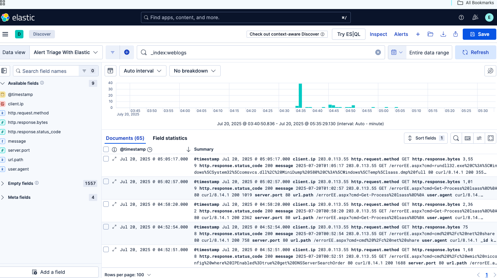
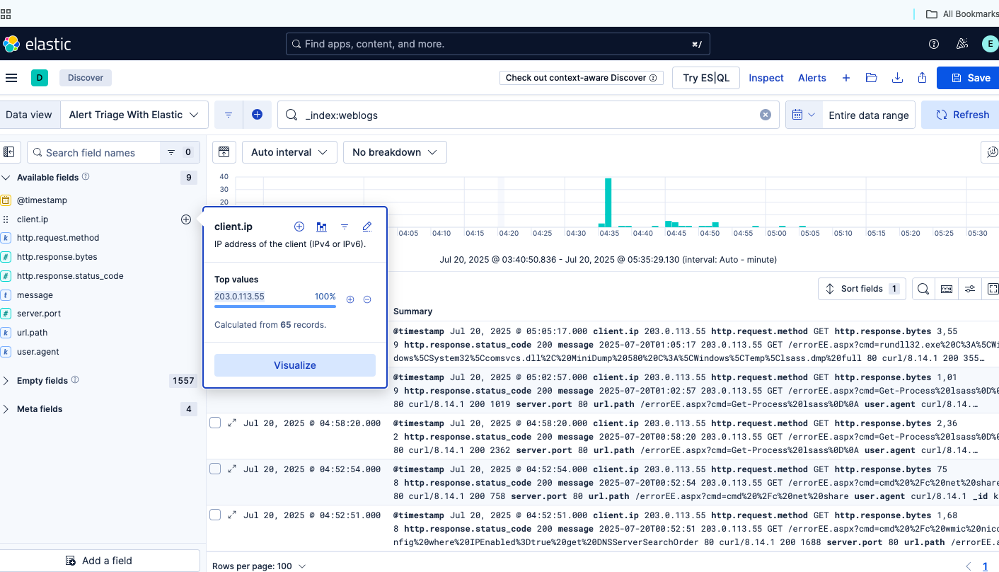
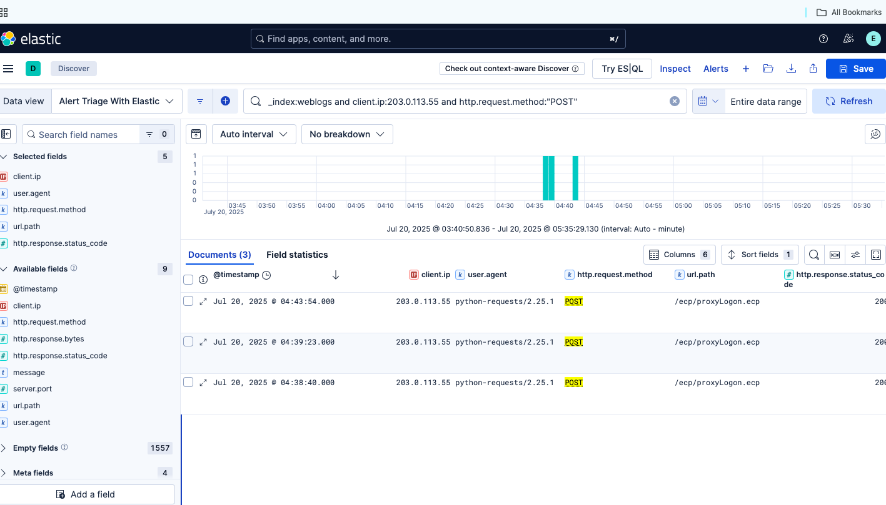
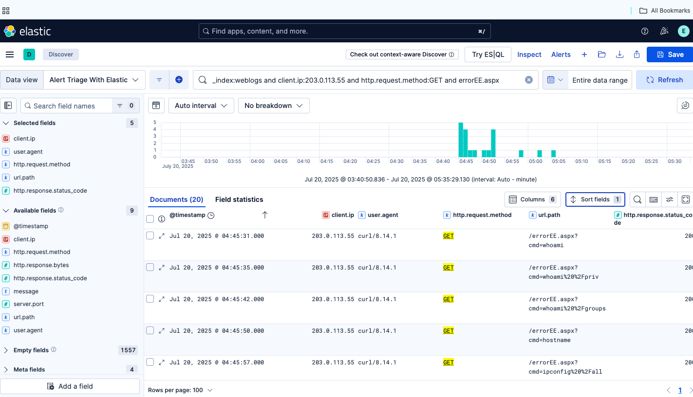
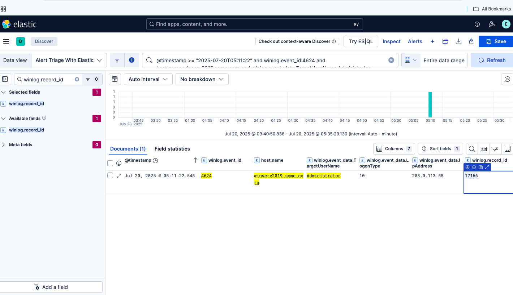
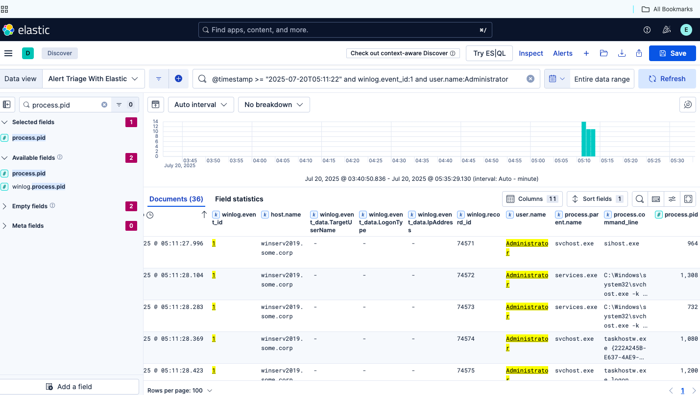
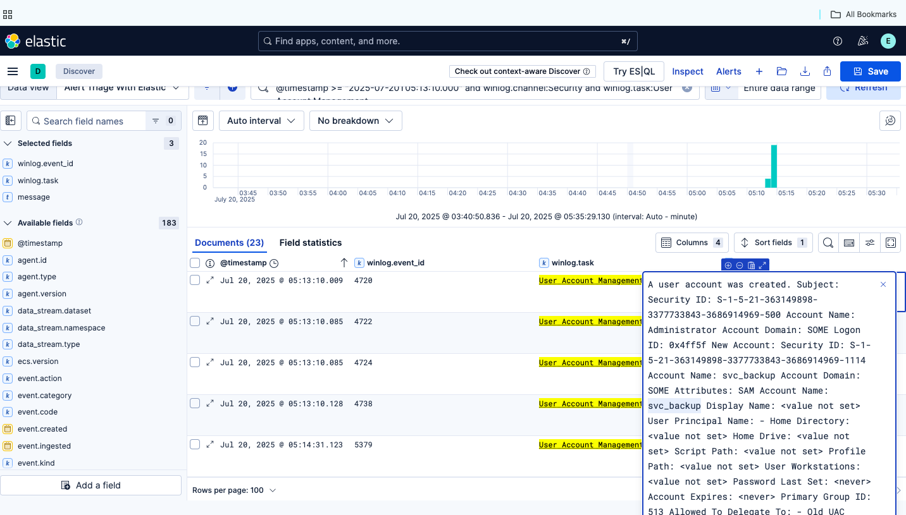
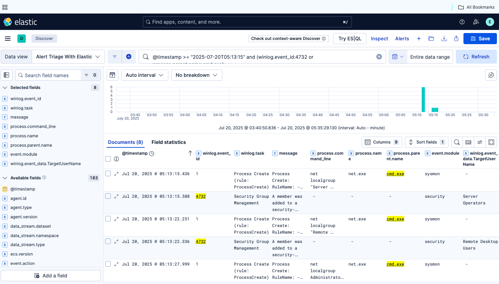
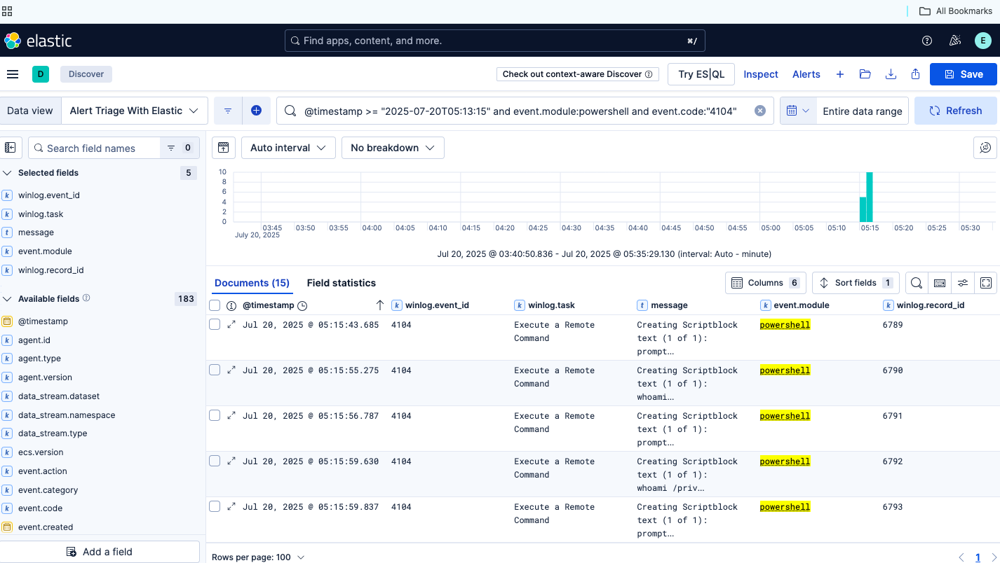
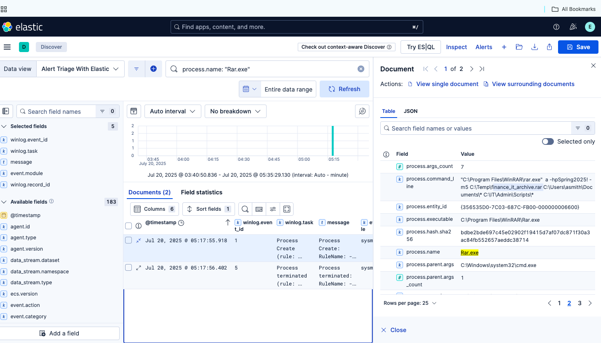

# Elastic Alert Triage and Windows Compromise Investigation

## Executive Summary

A multi-stage compromise affecting a Windows IIS server was investigated using Elastic Discover.

Analysis identified suspicious web requests originating from the external IP address `203.0.113.55`, followed by activity targeting Microsoft Exchange endpoints. A suspected web shell named `errorEE.aspx` was used to execute system-discovery commands. The same source IP was later associated with a remote logon using the built-in Administrator account.

Host-based investigation revealed the creation of a backdoor account named `svc_backup`, additions to multiple privileged local groups, suspicious PowerShell activity, and the creation of a password-protected archive containing finance documents and IT administration scripts.

Correlation across IIS, Windows Security, Sysmon, and PowerShell logs confirmed that the alerts represented a true-positive compromise requiring immediate escalation and containment.

---

## Investigation Overview

| Item | Details |
|---|---|
| Platform | Elastic Stack |
| Interface | Elastic Discover |
| Data sources | IIS, Windows Security, Sysmon, and PowerShell logs |
| Compromised host | `winserv2019.some.corp` |
| Suspected source IP | `203.0.113.55` |
| Primary account involved | `Administrator` |
| Backdoor account | `svc_backup` |
| Investigation type | Alert triage and incident reconstruction |
| Final verdict | True Positive — Confirmed Compromise |

---

## Investigation Objectives

The investigation aimed to:

- Review and prioritize the generated security alerts
- Identify the source of suspicious web activity
- Determine whether an IIS or Exchange endpoint had been exploited
- Confirm web-shell command execution
- Correlate web activity with Windows authentication events
- Investigate suspicious account creation and privilege changes
- Review PowerShell activity
- Identify signs of data collection and staging
- Reconstruct the attack timeline
- Recommend containment and remediation actions

---

# Alert Summary

| Alert | Severity | Assessment |
|---|---:|---|
| Web Requests Indicating File Upload | High | True Positive |
| GET Requests to ASPX File with Query Parameters | High | True Positive |
| Administrator Access Outside Business Hours | High | True Positive |
| New User Account Created | Critical | True Positive |
| Unusual Command-Line Behaviour: Privilege Changes | Critical | True Positive |

---

# Investigation Workflow

## 1. Review the Web-Server Logs

The investigation began by filtering the available data to the IIS web-log index.

### KQL Query

```text
_index:weblogs
```

The filtered dataset contained 65 web-server records. Initial analysis revealed repeated requests from the same client address to unusual Exchange and ASPX endpoints.

### Evidence



---

## 2. Identify the Suspicious Client IP

Field analysis showed that the available web requests originated from:

```text
203.0.113.55
```

This address was treated as the suspected source IP throughout the investigation and used to correlate activity across multiple log sources.

### Evidence



---

## 3. Investigate ProxyLogon POST Requests

The first alert reported multiple POST requests to the following Exchange endpoint:

```text
/ecp/proxyLogon.ecp
```

The logs were filtered using the suspected source IP and HTTP request method.

### KQL Query

```text
_index:weblogs and client.ip:203.0.113.55 and http.request.method:"POST"
```

Three POST requests were identified. All used the following user agent:

```text
python-requests/2.25.1
```

The automated user agent, repeated POST requests, and targeted Exchange endpoint were inconsistent with ordinary browser activity and were consistent with attempted exploitation of a public-facing application.

### Evidence



---

## 4. Confirm Web-Shell Command Execution

A second alert identified GET requests to an ASPX file containing a `cmd=` query parameter.

### KQL Query

```text
_index:weblogs and client.ip:203.0.113.55 and http.request.method:GET and errorEE.aspx
```

Twenty requests involving the suspected web shell were discovered.

Examples included:

```text
/errorEE.aspx?cmd=whoami
/errorEE.aspx?cmd=whoami%20%2Fpriv
/errorEE.aspx?cmd=whoami%20%2Fgroups
/errorEE.aspx?cmd=hostname
/errorEE.aspx?cmd=ipconfig%20%2Fall
```

These commands demonstrate post-exploitation discovery activity, including enumeration of the current user, privileges, group memberships, hostname, and network configuration.

### Evidence



---

## 5. Confirm Remote Administrator Access

The investigation then pivoted from IIS logs to Windows Security events.

A successful remote logon involving the Administrator account was identified using Windows Event ID `4624`.

### KQL Query

```text
@timestamp >= "2025-07-20T05:11:22"
and winlog.event_id:4624
and host.name:winserv2019.some.corp
and winlog.event_data.TargetUserName:Administrator
```

### Findings

| Field | Value |
|---|---|
| Event ID | `4624` |
| Timestamp | `2025-07-20 05:11:22.545` |
| Username | `Administrator` |
| Source IP | `203.0.113.55` |
| Logon type | `10 — RemoteInteractive` |
| Record ID | `17166` |

Logon type 10 indicates a RemoteInteractive session, commonly associated with Remote Desktop Protocol. The source IP matched the address involved in the earlier web activity.

### Evidence



---

## 6. Correlate the Logon with Process Creation

Sysmon Event ID `1` records were reviewed following the remote Administrator session.

### KQL Query

```text
@timestamp >= "2025-07-20T05:11:22"
and winlog.event_id:1
and user.name:Administrator
```

The results showed multiple processes running under the Administrator account immediately after the remote logon.

The first correlated process appeared at:

```text
2025-07-20 05:11:27.996
```

with process ID:

```text
964
```

The close timing between the remote authentication and subsequent process creation indicated that the session was actively used.

### Evidence



---

## 7. Review User-Account Management Events

A critical alert reported that a new user account had been created.

### KQL Query

```text
@timestamp >= "2025-07-20T05:13:10.000"
and winlog.channel:Security
and winlog.task:"User Account Management"
```

The investigation identified a sequence of account-management events:

| Event ID | Meaning |
|---:|---|
| 4720 | A user account was created |
| 4722 | A user account was enabled |
| 4724 | An attempt was made to reset an account password |
| 4738 | A user account was changed |

### Evidence


---

## 8. Identify the Backdoor Account

The expanded Event ID `4720` record identified the newly created account as:

```text
svc_backup
```

The service-style name could allow the account to blend in with legitimate administrative or backup accounts.

The account was created by the Administrator account shortly after the suspicious remote logon.

### Evidence



---

## 9. Identify Privileged Group Membership Changes

Sysmon process-creation events were correlated with Windows Security Event ID `4732`, which records the addition of members to local security groups.

The investigation showed that `net.exe`, launched through `cmd.exe`, was used to add `svc_backup` to privileged groups.

Observed target groups included:

```text
Server Operators
Remote Desktop Users
Administrators
```

One identified command was:

```cmd
net localgroup "Remote Desktop Users" svc_backup /add
```

These changes granted the backdoor account increased privileges and the ability to access the system remotely.

### Evidence



---

## 10. Investigate PowerShell Activity

PowerShell Script Block Logging was reviewed using Event ID `4104`.

### KQL Query

```text
@timestamp >= "2025-07-20T05:13:15"
and event.module:powershell
and event.code:"4104"
```

Fifteen script-block events were identified. The commands included further identity and privilege discovery.

One observed PowerShell command was:

```powershell
net group "Domain Admins" /domain
```

This command enumerates members of the domain-level administrative group.

### Evidence



---

## 11. Identify Archive Creation

The final investigation stage searched for execution of the WinRAR command-line utility.

### KQL Query

```text
process.name:"Rar.exe"
```

The process details showed that `Rar.exe` was launched by `cmd.exe` and used to create a password-protected archive.

### Public Report Command Line

```cmd
"C:\Program Files\WinRAR\rar.exe" a -hp[REDACTED] -m5 C:\Temp\finance_it_archive.rar C:\Users\asmith\Documents\* C:\IT\Admin\Scripts\*
```

The archive password has intentionally been redacted from this public report.

### Findings

| Field | Value |
|---|---|
| Process | `Rar.exe` |
| Executable | `C:\Program Files\WinRAR\Rar.exe` |
| Parent process | `C:\Windows\System32\cmd.exe` |
| Archive | `C:\Temp\finance_it_archive.rar` |
| Data targeted | User documents and IT administration scripts |
| Archive protection | Password-protected |

The archive creation was consistent with data staging before possible exfiltration. The available evidence confirmed collection and archiving but did not independently confirm that the archive left the environment.

### Evidence



---

# Attack Timeline

| Time | Activity |
|---|---|
| 04:38:40 | First suspicious POST request to `/ecp/proxyLogon.ecp` |
| 04:39:23 | Second ProxyLogon POST request |
| 04:43:54 | Third ProxyLogon POST request |
| 04:45:31 | Web shell executes `whoami` |
| 04:45:35 | Web shell executes `whoami /priv` |
| 04:45:42 | Web shell executes `whoami /groups` |
| 04:45:50 | Web shell executes `hostname` |
| 04:45:57 | Web shell executes `ipconfig /all` |
| 05:11:22 | Administrator RemoteInteractive logon from the suspected source IP |
| 05:11:27 | Processes begin running under Administrator |
| 05:13:10 | `svc_backup` account created |
| 05:13:15 | Privileged local-group modifications begin |
| 05:15:43 | PowerShell Script Block activity begins |
| 05:16:14 | Domain Administrators group enumeration |
| 05:17:55 | `finance_it_archive.rar` created using `Rar.exe` |

---

# Indicators of Compromise

## Suspected Source IP

```text
203.0.113.55
```

## Compromised Host

```text
winserv2019.some.corp
```

## Suspicious Account

```text
svc_backup
```

## Web Endpoints

```text
/ecp/proxyLogon.ecp
/errorEE.aspx
```

## Suspicious Processes

```text
cmd.exe
net.exe
powershell.exe
Rar.exe
```

## Staged Archive

```text
C:\Temp\finance_it_archive.rar
```

## User Agents

```text
python-requests/2.25.1
curl/8.14.1
```

---

# MITRE ATT&CK Mapping

| Tactic | Technique | ID | Evidence |
|---|---|---|---|
| Initial Access | Exploit Public-Facing Application | T1190 | Suspicious POST requests targeted the Exchange ProxyLogon endpoint |
| Persistence | Server Software Component: Web Shell | T1505.003 | Commands were executed through `errorEE.aspx` |
| Execution | Command and Scripting Interpreter: Windows Command Shell | T1059.003 | Commands were executed using `cmd.exe` |
| Execution | Command and Scripting Interpreter: PowerShell | T1059.001 | PowerShell Event ID 4104 activity was identified |
| Persistence | Create Account: Local Account | T1136.001 | The `svc_backup` account was created |
| Persistence / Privilege Escalation | Account Manipulation: Additional Local or Domain Groups | T1098.007 | `svc_backup` was added to privileged local groups |
| Lateral Movement | Remote Services: Remote Desktop Protocol | T1021.001 | Administrator logged on using RemoteInteractive logon type 10 |
| Discovery | System Owner/User Discovery | T1033 | `whoami` was executed |
| Discovery | Permission Groups Discovery | T1069 | Privilege and domain-group information was requested |
| Discovery | System Network Configuration Discovery | T1016 | `ipconfig /all` was executed |
| Collection | Archive Collected Data: Archive via Utility | T1560.001 | Documents and scripts were archived using `Rar.exe` |

---

# SOC Assessment

The correlated evidence supports a confirmed compromise of:

```text
winserv2019.some.corp
```

The evidence is consistent with exploitation of a public-facing Exchange service followed by access to a web shell. The operator used the web shell to perform host and privilege discovery before establishing a RemoteInteractive session using the Administrator account.

The subsequent creation of `svc_backup`, its addition to privileged groups, PowerShell-based discovery, and password-protected archive creation demonstrate persistence, privilege expansion, reconnaissance, and data staging.

The source IP `203.0.113.55` was observed across both the web-exploitation activity and the remote Administrator logon. Based on this correlation, it can be assessed as the threat-actor-controlled source for this incident.

All reviewed alerts should be classified as **True Positives** and escalated as a high-priority security incident.

---

# Recommended Response Actions

1. Immediately isolate `winserv2019.some.corp` from the network.

2. Block `203.0.113.55` at the firewall, proxy, WAF, and endpoint layers.

3. Remove and preserve `errorEE.aspx` for forensic analysis.

4. Disable and investigate the `svc_backup` account.

5. Reset credentials for the Administrator account and other privileged users.

6. Review all Remote Desktop activity involving the affected host.

7. Remove unauthorized users from privileged local groups.

8. Preserve Windows Security, Sysmon, IIS, and PowerShell logs.

9. Locate and quarantine:

```text
C:\Temp\finance_it_archive.rar
```

10. Determine whether the archive was transferred outside the environment.

11. Search all systems for:

```text
errorEE.aspx
svc_backup
finance_it_archive.rar
203.0.113.55
```

12. Patch the affected Exchange and IIS components.

13. Add detections for:

- POST requests to `/ecp/proxyLogon.ecp`
- ASPX requests containing `cmd=`
- Event ID 4624 with logon type 10 from unusual addresses
- Event ID 4720 account creation
- Event ID 4732 privileged group membership changes
- PowerShell Event ID 4104
- Command-line execution of `rar.exe`
- Accounts added to Administrators, Server Operators, or Remote Desktop Users

---

# Skills Demonstrated

- Elastic Discover and KQL
- Security alert triage
- IIS web-log analysis
- Windows Security Event analysis
- Sysmon process investigation
- PowerShell Script Block analysis
- Web-shell detection
- Account and privilege investigation
- Cross-source event correlation
- Attack timeline reconstruction
- Indicator-of-compromise extraction
- MITRE ATT&CK mapping
- Incident escalation and response planning

---

# Tools Used

- Elastic Stack
- Elastic Discover
- Kibana Query Language
- IIS logs
- Windows Security logs
- Sysmon
- PowerShell Operational logs
- MITRE ATT&CK

---

## Disclaimer

This investigation was completed in an authorized cybersecurity training environment. Challenge flags, submitted-answer screenshots, and exposed credentials have intentionally been excluded or redacted from this public report.
