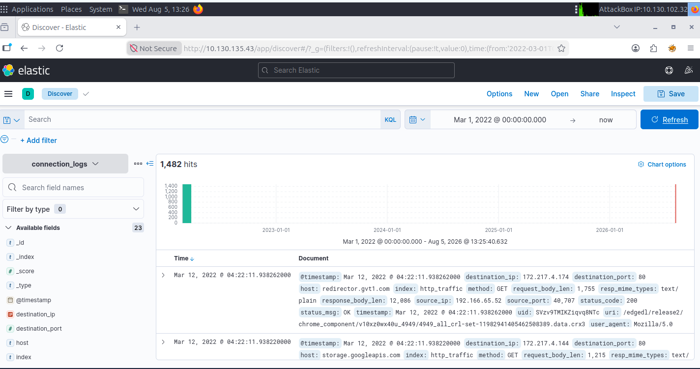
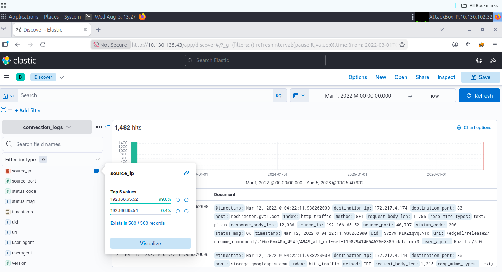
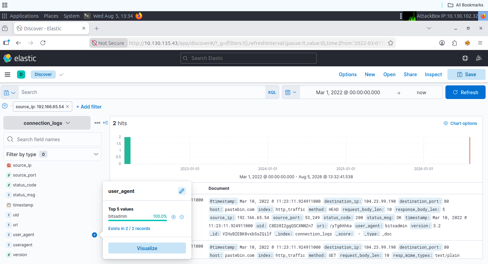
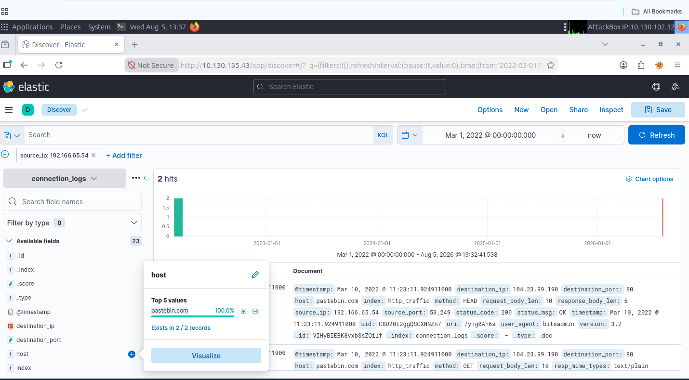
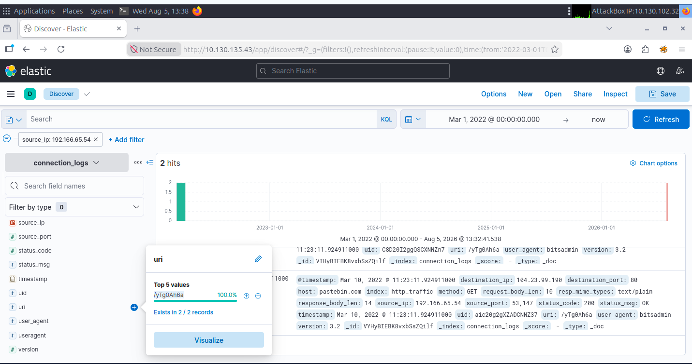

# Potential C2 Communication Investigation with Elastic

## Executive Summary

A potential command-and-control communication alert involving an HR workstation was investigated using Elastic Discover.

Analysis of HTTP connection logs identified an unusual internal source IP, `192.166.65.54`, making two connections to `pastebin.com`. The traffic used the uncommon user agent `bitsadmin`, suggesting possible abuse of the legitimate Windows Background Intelligent Transfer Service utility.

The endpoint issued both `HEAD` and `GET` requests to the Pastebin resource `/yTg0Ah6a`, which was associated with a file named `secret.txt`. The file contained the suspicious pattern referenced in the original security alert.

The activity was assessed as a **true-positive suspicious file-retrieval event with potential command-and-control characteristics**.

---

## Investigation Overview

| Item | Details |
|---|---|
| Platform | Elastic Stack |
| Interface | Elastic Discover |
| Data source | HTTP connection logs |
| Index | `connection_logs` |
| Investigation period | March 2022 |
| User involved | Browne — HR department |
| Suspected internal host IP | `192.166.65.54` |
| External host | `pastebin.com` |
| Destination IP | `104.23.99.190` |
| Destination port | `80` |
| Suspected utility | `bitsadmin` |
| Accessed file | `secret.txt` |
| Final verdict | True Positive — Suspicious File Retrieval / Potential C2 Communication |

---

## Investigation Objectives

The investigation aimed to:

- Validate the available connection-log dataset
- Identify the IP address associated with the suspected user
- Distinguish routine traffic from anomalous traffic
- Identify the Windows utility involved in the connection
- Determine the external host contacted
- Extract the suspicious resource path
- Identify the accessed file
- Assess whether the activity was consistent with C2 communication
- Recommend containment and detection actions

---

# Investigation Workflow

## 1. Validate the Connection Logs

The investigation began by reviewing the complete `connection_logs` dataset in Elastic Discover.

The selected time range returned:

```text
1,482 events
```

The records contained useful network fields including:

```text
source_ip
source_port
destination_ip
destination_port
host
method
uri
user_agent
status_code
```

### Evidence



---

## 2. Analyze Source-IP Frequency

The `source_ip` field was reviewed to identify systems responsible for the available traffic.

Two internal source addresses were present:

| Source IP | Percentage of sampled events | Initial assessment |
|---|---:|---|
| `192.166.65.52` | 99.6% | High-volume routine traffic |
| `192.166.65.54` | 0.4% | Rare outlier requiring investigation |

The most common IP was not automatically treated as suspicious. Instead, the rare address `192.166.65.54` was investigated because low-frequency traffic to an unusual external service may indicate targeted or automated activity.

Filtering for this address returned only two records.

### KQL Filter

```text
source_ip:"192.166.65.54"
```

### Evidence



---

## 3. Identify the Suspicious User Agent

The two events associated with `192.166.65.54` were analyzed using the `user_agent` field.

Both records used:

```text
bitsadmin
```

The logs also showed the following version value:

```text
3.2
```

BITSAdmin is a legitimate Windows utility that can manage background file transfers. Its appearance as a user agent in rare outbound traffic to a file-sharing service was considered suspicious.

Because only network connection logs were available, this evidence suggests possible BITSAdmin abuse but does not independently confirm the process command line or BITS job configuration.

### Evidence



---

## 4. Identify the External Destination

The `host` field showed that both suspicious connections were made to:

```text
pastebin.com
```

Additional network details included:

| Field | Value |
|---|---|
| Source IP | `192.166.65.54` |
| Destination IP | `104.23.99.190` |
| Destination port | `80` |
| External host | `pastebin.com` |
| HTTP methods | `HEAD` and `GET` |
| Status code | `200` |
| Status message | `OK` |

The use of a public text-sharing service does not prove malicious activity by itself. However, its correlation with the rare source IP and `bitsadmin` user agent significantly increased the risk associated with the events.

### KQL Filter

```text
source_ip:"192.166.65.54" and host:"pastebin.com"
```

### Evidence



---

## 5. Extract the Suspicious Resource Path

The `uri` field identified the specific Pastebin resource accessed by the endpoint:

```text
/yTg0Ah6a
```

The observed external resource was therefore:

```text
pastebin.com/yTg0Ah6a
```

The connection sequence contained both a `HEAD` request and a `GET` request. This is consistent with a client first checking information about a remote resource and then retrieving its contents.

### KQL Filter

```text
source_ip:"192.166.65.54"
and host:"pastebin.com"
and uri:"/yTg0Ah6a"
```

### Evidence



---

## 6. Identify the Accessed File

Review of the Pastebin resource identified the accessed file as:

```text
secret.txt
```

The file contained the suspicious pattern referenced in the original alert.

The challenge flag and file contents have intentionally been excluded from this public report. Including the flag would not strengthen the technical investigation and could expose protected training answers.

---

# Key Findings

| Finding | Result |
|---|---|
| Total connection events reviewed | `1,482` |
| Suspected internal source IP | `192.166.65.54` |
| Number of suspicious records | `2` |
| Suspected Windows utility | `bitsadmin` |
| External host | `pastebin.com` |
| Destination IP | `104.23.99.190` |
| Destination port | `80` |
| HTTP methods | `HEAD`, `GET` |
| Suspicious URI | `/yTg0Ah6a` |
| Accessed file | `secret.txt` |
| Final verdict | True Positive — Suspicious File Retrieval / Potential C2 Communication |

---

# Event Timeline

## March 10, 2022 — 11:23:11

The internal endpoint `192.166.65.54` communicated with `pastebin.com` at `104.23.99.190` over destination port `80`.

Two events were recorded:

1. A `HEAD` request checked the remote resource.
2. A `GET` request retrieved the resource contents.

Both events used the `bitsadmin` user agent and targeted:

```text
/yTg0Ah6a
```

The combination of an uncommon internal source, a trusted Windows transfer utility, a public file-sharing service, and content matching the malicious alert pattern supported escalation of the activity.

---

# Indicators of Compromise

## Internal Endpoint

```text
192.166.65.54
```

## External Destination

```text
104.23.99.190
```

## External Host

```text
pastebin.com
```

## Suspicious Resource

```text
pastebin.com/yTg0Ah6a
```

## URI

```text
/yTg0Ah6a
```

## User Agent

```text
bitsadmin
```

## Accessed File

```text
secret.txt
```

---

# MITRE ATT&CK Mapping

| Tactic | Technique | ID | Confidence | Evidence |
|---|---|---|---|---|
| Execution / Persistence / Defense Evasion | BITS Jobs | T1197 | Medium | Network traffic used the `bitsadmin` user agent, suggesting possible BITSAdmin abuse |
| Command and Control | Ingress Tool Transfer | T1105 | High | A file was retrieved from an external system |
| Command and Control | Application Layer Protocol: Web Protocols | T1071.001 | High | The endpoint communicated using HTTP `HEAD` and `GET` requests |
| Command and Control | Web Service: One-Way Communication | T1102.003 | Medium | A legitimate public web service may have been used to host instructions or malicious content |

The BITS Jobs mapping is assessed with medium confidence because the network logs show the `bitsadmin` user agent but do not contain endpoint process telemetry or the exact command line.

The one-way web-service mapping is also assessed with medium confidence because the available logs confirm retrieval from Pastebin but do not show a complete interactive C2 channel.

---

# SOC Assessment

The activity should be classified as:

```text
True Positive — Suspicious File Retrieval / Potential C2 Communication
```

Several pieces of evidence support this verdict:

- `192.166.65.54` generated only a small number of events, making it a clear outlier.
- Both events contacted a public text-sharing service.
- The connections used the unusual `bitsadmin` user agent rather than a standard web browser.
- The endpoint issued both `HEAD` and `GET` requests to the same resource.
- The accessed file contained the suspicious pattern associated with the original IDS alert.

The evidence is consistent with possible BITSAdmin abuse to retrieve content from a legitimate external service. Pastebin may have been used as a file-delivery location, dead-drop location, or one-way communication channel.

However, the investigation was limited to HTTP connection logs. Endpoint telemetry would be required to confirm the exact BITS command, local destination path, process tree, persistence mechanism, and any execution that followed the download.

---

# Recommended Response Actions

1. Isolate the endpoint associated with `192.166.65.54`.

2. Block or closely monitor the identified resource:

```text
pastebin.com/yTg0Ah6a
```

3. Review proxy, DNS, firewall, and endpoint logs for other systems communicating with:

```text
pastebin.com
104.23.99.190
```

4. Search the affected endpoint for:

```text
secret.txt
```

5. Collect and review:

```text
Windows process-creation logs
Sysmon Event ID 1
Sysmon Event ID 3
Sysmon Event ID 11
Microsoft-Windows-Bits-Client logs
PowerShell logs
Browser and download history
```

6. Identify the exact command line used to start the suspected BITS job.

7. Check for active or persistent BITS jobs on the affected endpoint.

8. Scan the retrieved file in an isolated malware-analysis environment.

9. Review the affected user’s authentication activity for signs of account compromise.

10. Reset the user’s credentials if unauthorized access is confirmed.

11. Hunt across the environment for the `bitsadmin` user agent and rare connections to public file-sharing services.

---

# Detection Opportunities

## Detect BITSAdmin Traffic to Pastebin

```text
host:"pastebin.com" and user_agent:"bitsadmin"
```

## Hunt for the Identified Endpoint

```text
source_ip:"192.166.65.54"
```

## Detect Similar Rare Connections

```text
user_agent:"bitsadmin" and method:("GET" or "HEAD")
```

## Detect the Known Resource

```text
host:"pastebin.com" and uri:"/yTg0Ah6a"
```

Additional detections should alert when trusted Windows utilities communicate directly with public file-sharing or text-sharing services.

---

# Investigation Limitations

Only HTTP connection logs were available for this investigation.

The available evidence did not include:

- Endpoint process-creation records
- The exact BITSAdmin command line
- Local file-creation telemetry
- File hash information
- Evidence showing whether the retrieved file was executed
- Additional post-download activity
- Full packet-capture data

The findings therefore confirm suspicious file retrieval and potential C2 communication, but not the complete endpoint execution chain.

---

# Skills Demonstrated

- Elastic Discover analysis
- KQL filtering
- HTTP connection-log investigation
- Source-IP frequency analysis
- Network anomaly identification
- User-agent analysis
- Living-off-the-Land Binary detection
- External-service investigation
- Indicator-of-compromise extraction
- Potential C2 traffic assessment
- MITRE ATT&CK mapping
- Incident escalation
- Detection recommendation development

---

# Tools Used

- Elastic Stack
- Elastic Discover
- Kibana Query Language
- HTTP connection logs
- MITRE ATT&CK
- TryHackMe training environment

---

## Disclaimer

This investigation was completed in an authorized cybersecurity training environment. Challenge flags and submitted-answer screenshots have intentionally been excluded from this public report.
