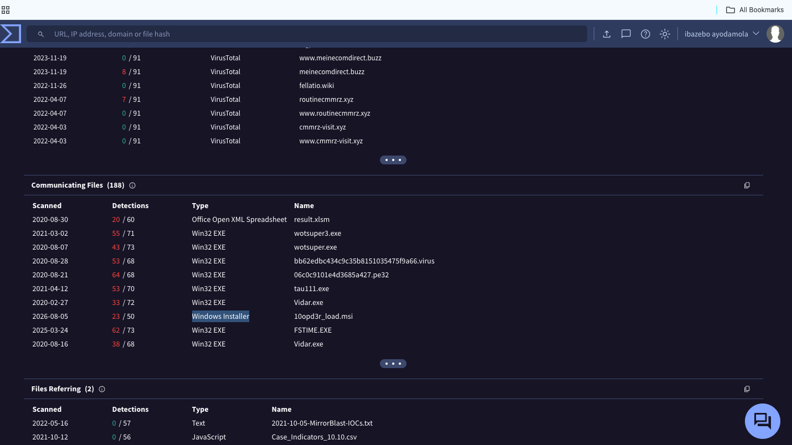

# Warzone 1 — Malware Command and Control Investigation

## Overview

This investigation involved triaging an IDS/IPS alert indicating potentially malicious network traffic and possible Command and Control (C2) activity.

Using **Brim**, **Wireshark**, and **VirusTotal**, I analyzed the provided PCAP, identified the affected host, investigated suspicious external infrastructure, examined HTTP traffic, traced downloaded payloads, and recovered file-system artifacts from TCP streams.

The investigation confirmed suspicious HTTP communication associated with the **MirrorBlast** malware family and infrastructure associated with **TA505** in VirusTotal Community intelligence.

---

## Investigation Objective

The objectives of this investigation were to:

- Triage the IDS/IPS alert.
- Identify the compromised internal host.
- Determine the suspicious external infrastructure.
- Investigate the malware C2 traffic.
- Analyze HTTP requests and user-agent activity.
- Identify downloaded payloads.
- Enrich suspicious infrastructure using threat intelligence.
- Inspect TCP streams for host-level artifacts.
- Determine whether the alert should be classified as a true positive.

---

## Tools Used

- **Brim** — PCAP analysis and investigation of Zeek/Suricata network data.
- **Wireshark** — Packet inspection and TCP stream analysis.
- **VirusTotal** — Threat intelligence enrichment of suspicious infrastructure.

---

# Investigation

## 1. IDS Alert Triage

I began by reviewing the Suricata alerts generated from the packet capture.

The following recurring alert was identified:

```text
ET MALWARE MirrorBlast CnC Activity M3
```

The traffic involved:

```text
Source IP:      172.16.1.102
Destination IP: 169.239.128.11
Destination Port: 80
Protocol: HTTP
```

Additional Suricata alerts also identified the use of a suspicious **REBOL** user-agent.

This established `172.16.1.102` as the internal system requiring further investigation.


### Initial Finding

The alert was not treated as malicious based solely on the IDS signature. I continued the investigation to validate the activity using network traffic and external threat intelligence.

---

## 2. Threat Intelligence Enrichment

I investigated the destination IP:

```text
169.239.128.11
```

VirusTotal Community intelligence showed references connecting the infrastructure with **MirrorBlast** and **TA505-related activity**.

Because community intelligence is not definitive attribution by itself, I treated this information as supporting context rather than proof of attacker identity.


### Finding

The external IP observed in the PCAP had historical threat-intelligence associations with MirrorBlast and TA505-related infrastructure.

This increased confidence that the IDS alert represented potentially malicious activity.

---

## 3. Associated Files

I next reviewed the **Communicating Files** associated with the suspicious infrastructure in VirusTotal.

VirusTotal analysis identified **Windows Installer packages** among the communicating files associated with the infrastructure.

One of the files identified during the investigation was:

```text
10opd3r_load.msi
```



This information helped correlate the external infrastructure with later file-transfer activity identified inside the PCAP.

---

## 4. HTTP C2 Traffic Analysis

I returned to Brim and filtered the HTTP traffic involving:

```text
169.239.128.11
```

Repeated HTTP communications were visible between the victim and the external server.

The traffic contained the following unusual user-agent:

```text
REBOL View 2.7.8.3.1
```


### Finding

The uncommon REBOL user-agent, repeated HTTP requests, existing Suricata C2 detections, and external threat-intelligence context collectively strengthened the case that this was not normal user browsing.

---

## 5. Additional Infrastructure and Payloads

Further analysis identified two additional external IP addresses associated with file-transfer activity:

```text
185.10.68.235
192.36.27.92
```

The downloaded files were:

```text
filter.msi
10opd3r_load.msi
```

Brim showed `filter.msi` being transferred from infrastructure associated with the suspicious network activity.


The presence of multiple external systems and downloaded installer packages indicated that the activity extended beyond simple C2 communication and included payload delivery.

---

## 6. Wireshark TCP Stream Analysis — First Payload

To investigate what the downloaded installer attempted to place on the system, I opened the relevant TCP stream in Wireshark.

Inspection of the installer data revealed references to:

```text
C:\ProgramData\001\arab.bin
C:\ProgramData\001\arab.exe
```


### Finding

The network capture exposed host-level installation artifacts inside the transferred MSI data, allowing the probable destination files to be identified without having direct access to the endpoint.

---

## 7. Wireshark TCP Stream Analysis — Second Payload

I then analyzed the TCP stream associated with the second downloaded MSI.

The stream contained references to:

```text
C:\ProgramData\Local\Google\rebol-view-278-3-1.exe
C:\ProgramData\Local\Google\exemple.rb
```


This provided additional evidence connecting the network activity with the REBOL executable observed in the suspicious HTTP user-agent.

---

# Key Findings

| Category | Finding |
|---|---|
| Compromised Host | `172.16.1.102` |
| Primary C2 IP | `169.239.128.11` |
| Alert Signature | `ET MALWARE MirrorBlast CnC Activity M3` |
| Malware Family | MirrorBlast |
| Threat Intelligence | Infrastructure associated with TA505 in VirusTotal Community intelligence |
| Network Protocol | HTTP |
| Suspicious User-Agent | `REBOL View 2.7.8.3.1` |
| Additional IP | `185.10.68.235` |
| Additional IP | `192.36.27.92` |
| Downloaded Payload | `filter.msi` |
| Downloaded Payload | `10opd3r_load.msi` |
| Recovered Artifact | `C:\ProgramData\001\arab.bin` |
| Recovered Artifact | `C:\ProgramData\001\arab.exe` |
| Recovered Artifact | `C:\ProgramData\Local\Google\rebol-view-278-3-1.exe` |
| Recovered Artifact | `C:\ProgramData\Local\Google\exemple.rb` |

---

# Indicators of Compromise

## IP Addresses

```text
169.239.128.11
185.10.68.235
192.36.27.92
```

## Files

```text
filter.msi
10opd3r_load.msi
arab.bin
arab.exe
rebol-view-278-3-1.exe
exemple.rb
```

## Network Indicator

```text
User-Agent: REBOL View 2.7.8.3.1
```

---

# MITRE ATT&CK Mapping

| Technique | ID | Evidence |
|---|---|---|
| Application Layer Protocol: Web Protocols | **T1071.001** | Suspicious HTTP communication between the victim and external infrastructure |
| Ingress Tool Transfer | **T1105** | MSI payloads were downloaded to the compromised host over the network |

I limited the ATT&CK mapping to techniques that could be reasonably supported by the available PCAP evidence.

---

# SOC Assessment

**Verdict:** True Positive  
**Analyst-assessed Severity:** High

The alert should be escalated as a confirmed security incident.

The assessment is supported by several correlated indicators:

- Suricata generated repeated MirrorBlast C2 alerts.
- The internal host communicated with suspicious external infrastructure.
- VirusTotal provided supporting threat-intelligence associations with MirrorBlast and TA505-related activity.
- Suspicious REBOL HTTP traffic was identified.
- Multiple MSI payloads were transferred.
- TCP stream analysis revealed executable and script artifacts associated with the transferred files.

Rather than relying on a single IDS signature, the verdict was reached by correlating IDS alerts, HTTP activity, threat intelligence, downloaded payloads, and packet-level evidence.

---

# Recommended Response Actions

If this activity were detected in a production SOC environment, I would recommend:

1. **Isolate `172.16.1.102`** from the network to prevent additional C2 communication.
2. **Block identified malicious infrastructure** at relevant network security controls.
3. **Search enterprise telemetry** for connections to the identified IP addresses and the REBOL user-agent.
4. **Hunt endpoints** for the identified MSI files, executables, and script artifacts.
5. **Collect endpoint telemetry** from the affected host to determine execution, persistence, and additional compromise.
6. **Perform malware analysis** on recovered payloads in an isolated environment.
7. **Review neighboring systems** for evidence of lateral movement or related infection.

---

# Conclusion

This investigation demonstrated how a network alert can be validated by correlating multiple sources of evidence.

Starting with a Suricata IDS detection, I used Brim to investigate the network communication, VirusTotal to enrich suspicious infrastructure, and Wireshark to inspect transferred payloads and recover host-related artifacts from TCP streams.

The combined evidence supported classification of the incident as a **True Positive involving suspicious MirrorBlast-associated C2 and payload-delivery activity**.

## Skills Demonstrated

- IDS/IPS alert triage
- PCAP analysis
- Brim / Zeek log analysis
- Suricata alert investigation
- Wireshark packet analysis
- TCP stream reconstruction
- HTTP traffic analysis
- Malware C2 identification
- IOC extraction
- Threat intelligence enrichment
- Payload investigation
- MITRE ATT&CK mapping
- SOC incident escalation and documentation

---

> **Lab Environment:** This investigation was completed in the TryHackMe *Warzone 1* cybersecurity training environment. All indicators and systems referenced in this report are part of the lab scenario.
