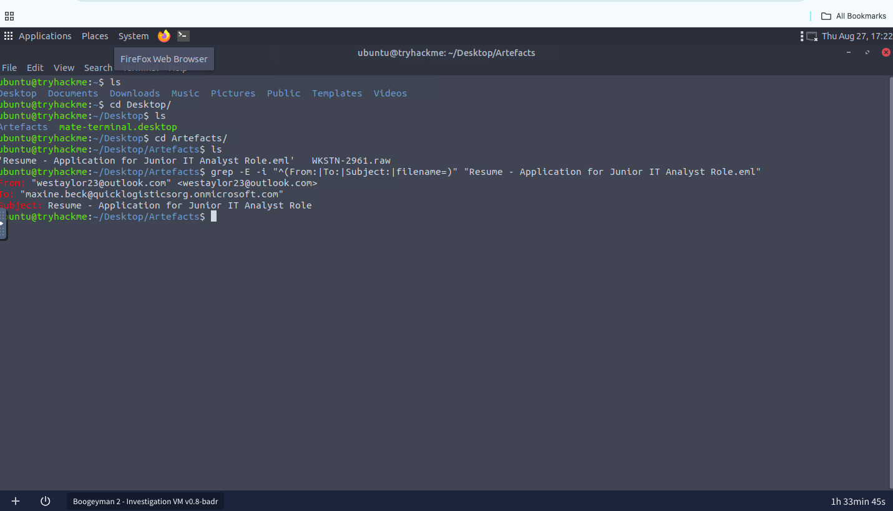
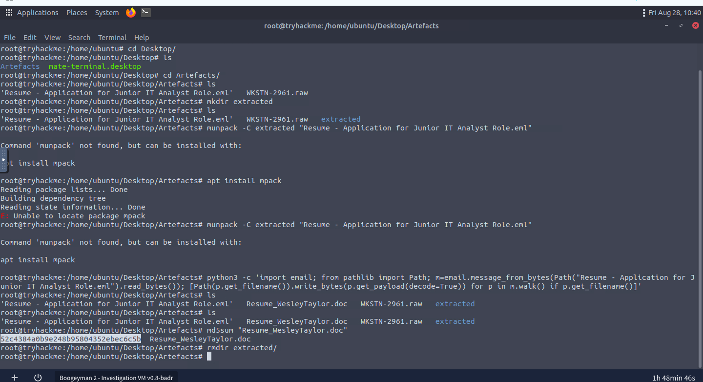
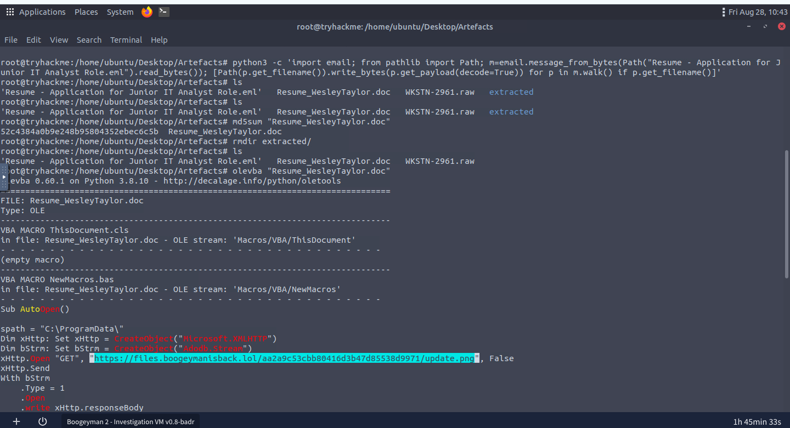
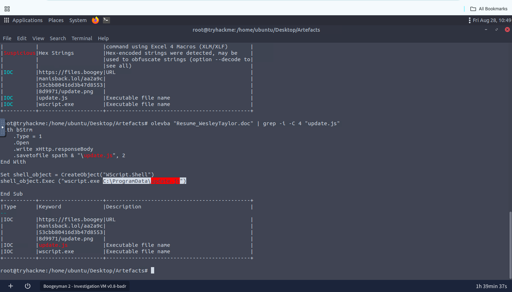
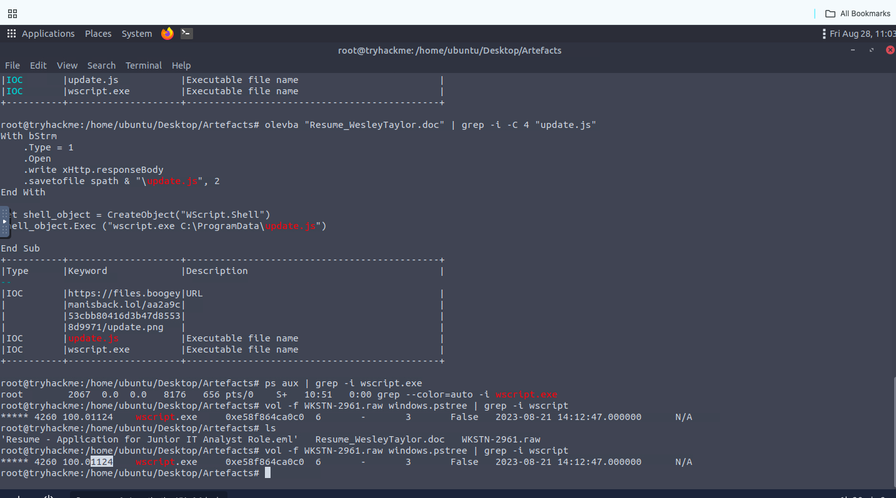
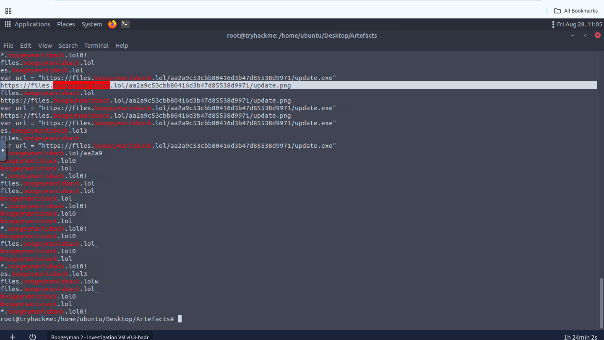
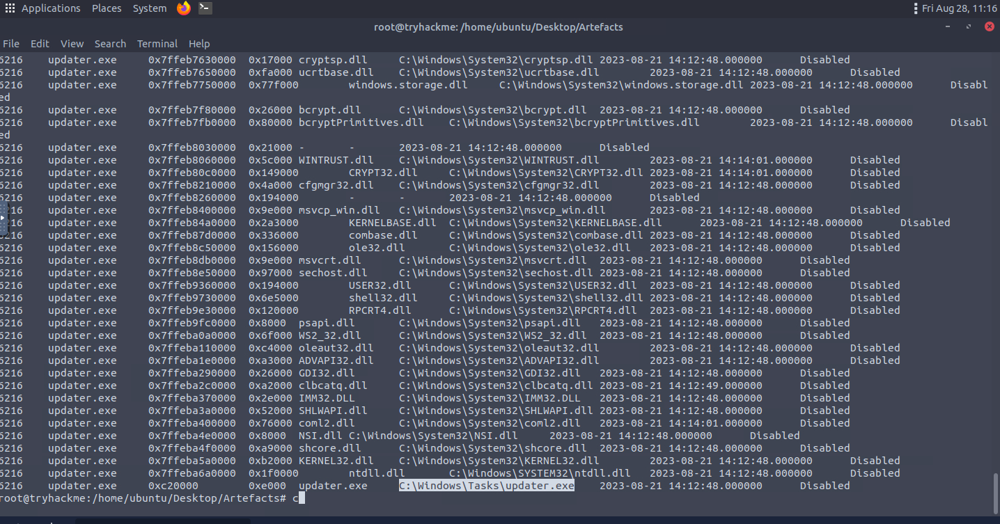
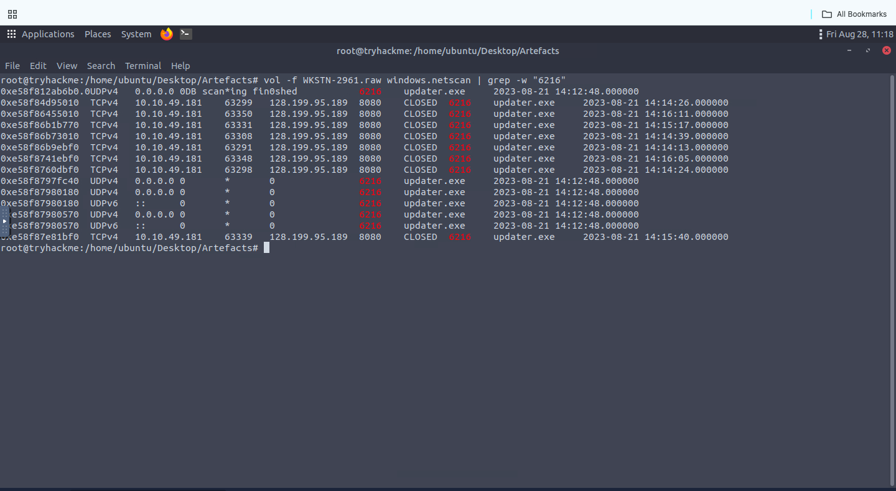
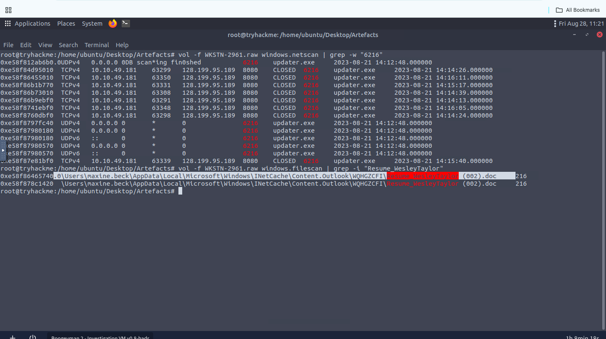
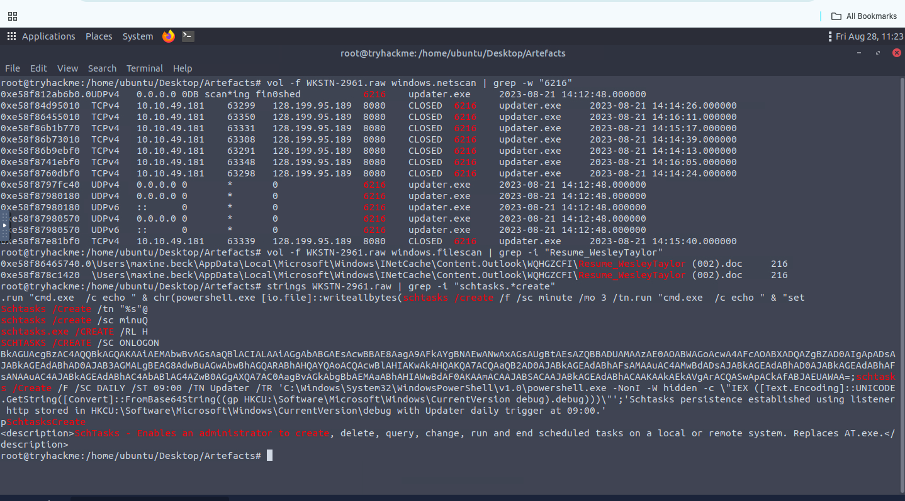

# Phishing-to-C2 Incident Investigation — Macro Malware and Memory Forensics

## Overview

This investigation involved analyzing a compromised Human Resources workstation following a targeted phishing email containing a malicious Microsoft Word attachment.

Using Linux command-line utilities, `olevba`, Python, and Volatility 3, I examined the email, extracted and hashed the attachment, analyzed its VBA macro, reconstructed the multi-stage payload execution chain, identified Command and Control (C2) activity, and recovered a scheduled-task persistence command from memory.

The investigation established the following attack chain:

```text
Phishing email
    → Malicious Word document
    → VBA AutoOpen macro
    → update.js
    → wscript.exe
    → updater.exe
    → C2 communication
    → Scheduled-task persistence
```

---

## Investigation Objectives

The objectives were to:

* Document the observed email sender and targeted employee.
* Extract and hash the malicious attachment.
* Analyze the embedded VBA macro.
* Identify downloaded payloads and execution commands.
* Reconstruct the process chain using memory forensics.
* Recover malicious file paths from memory.
* Identify the C2 infrastructure.
* Determine how the attacker established persistence.
* Extract actionable Indicators of Compromise.
* Recommend appropriate containment and remediation actions.

---

## Evidence Sources

```text
Resume - Application for Junior IT Analyst Role.eml
WKSTN-2961.raw
Resume_WesleyTaylor.doc
```

---

## Tools Used

* **grep** — Email-header, memory-string, URL, and command filtering.
* **file** — File-type identification.
* **Python email module** — Safe extraction of the email attachment.
* **md5sum** — Attachment hash calculation.
* **olevba** — VBA macro extraction and analysis.
* **strings** — Recovery of readable commands and URLs from memory.
* **Volatility 3** — Windows memory analysis.
* **windows.pstree** — Process and parent-process correlation.
* **windows.dlllist** — Process executable-path and loaded-module analysis.
* **windows.netscan** — Recovery of memory-resident network connections.
* **windows.filescan** — Recovery of file objects and file paths from memory.

---

## Investigation

### 1. Phishing Email Analysis

I began by examining the `.eml` file and filtering its headers.

```bash
grep -E -i "^(From:|To:|Subject:|filename=)" \
"Resume - Application for Junior IT Analyst Role.eml"
```

The email details were:

```text
Observed From Address: westaylor23@outlook.com
Recipient:             maxine.beck@quicklogisticsorg.onmicrosoft.com
Subject:               Resume - Application for Junior IT Analyst Role
```



#### Finding

The email used a job application as its social-engineering lure and targeted an employee working in Human Resources.

The subject and attached résumé provided a believable reason for the recipient to open the document.

Because the retained evidence only displayed the `From:` header, I treated `westaylor23@outlook.com` as the observed sender address rather than definitive proof of the email’s true origin. Confirming the originating sender would require analysis of the complete delivery chain and authentication headers.

---

### 2. Attachment Extraction and Hashing

I examined the MIME information and identified the attached document:

```text
Resume_WesleyTaylor.doc
```

Because a dedicated mail-analysis application was unavailable, I used Python’s email-parsing module to extract the attachment without opening it.

I then calculated its MD5 hash:

```bash
md5sum "Resume_WesleyTaylor.doc"
```

```text
52c4384a0b9e248b95804352ebec6c5b
```



#### Finding

The attachment was successfully extracted for static analysis without executing the document.

Its MD5 hash established a repeatable identifier for the lab investigation.

> MD5 was used as the lab-provided identifier. SHA256 would be preferred for production threat hunting and evidence-integrity validation.

---

### 3. VBA Macro Analysis — Payload Download

I analyzed the extracted Word document using `olevba`.

```bash
olevba "Resume_WesleyTaylor.doc"
```

The document contained an `AutoOpen` macro. This macro was configured to run when the document was opened and macros were permitted.

The macro created the following objects:

```text
Microsoft.XMLHTTP
Adodb.Stream
```

It then made an HTTP request to:

```text
https://files.boogeymanisback.lol/aa2a9c53cbb80416d3b47d85538d9971/update.png
```



#### Finding

The document was weaponized with an automatically triggered VBA macro.

Although the remote file used a `.png` extension, the macro treated its response as a script payload rather than an image. This extension mismatch was likely intended to make the download appear less suspicious.

---

### 4. Stage-Two Payload Creation and Execution

Further macro analysis showed that the downloaded response was saved as:

```text
C:\ProgramData\update.js
```

The macro then created a `WScript.Shell` object and executed:

```text
wscript.exe C:\ProgramData\update.js
```



#### Finding

The macro saved the downloaded response as `C:\ProgramData\update.js` and executed it using the legitimate Windows Script Host.

This established the transition from the malicious document to the second stage of the attack.

---

### 5. Memory Process Correlation

I used Volatility’s `windows.pstree` plugin to locate `wscript.exe` inside the memory image.

```bash
vol -f WKSTN-2961.raw windows.pstree | grep -i wscript
```

The process details were:

```text
Process: wscript.exe
PID:     4260
PPID:    1124
Created: 2023-08-21 14:12:47
```

PID `1124` was associated with `WINWORD.EXE`.



#### Finding

The parent-child relationship independently corroborated the macro analysis:

```text
WINWORD.EXE
    └── wscript.exe
```

Microsoft Word launching Windows Script Host immediately after the document was opened was highly suspicious and consistent with macro-based malware execution.

Neither `WINWORD.EXE` nor `wscript.exe` is malicious by itself. The suspicious behavior came from their relationship, timing, and associated command line.

---

### 6. Additional Payload Discovery

I searched the memory image for references to the malicious domain and recovered another payload URL:

```text
https://files.boogeymanisback.lol/aa2a9c53cbb80416d3b47d85538d9971/update.exe
```



#### Finding

The JavaScript stage downloaded an additional Windows executable from the same remote directory used by the Word macro.

This confirmed that the incident involved multiple payload stages:

```text
Word macro → update.js → update.exe
```

---

### 7. Malicious Executable Path

I investigated PID `6216` using Volatility and recovered its executable path:

```text
C:\Windows\Tasks\updater.exe
```



#### Finding

The downloaded binary was stored as `updater.exe` inside `C:\Windows\Tasks`.

The generic updater filename and its placement inside a Windows-related directory could help the malicious executable blend with legitimate system activity.

---

### 8. C2 Network Activity

I filtered Volatility’s network scan for PID `6216`.

```bash
vol -f WKSTN-2961.raw windows.netscan | grep -w "6216"
```

The output showed repeated outbound connections:

```text
Source:      10.10.49.181
Destination: 128.199.95.189
Port:        8080
Process:      updater.exe
PID:         6216
```



#### Finding

The memory image contained multiple socket records connecting `updater.exe` to:

```text
128.199.95.189:8080
```

Although the recovered records were marked `CLOSED`, their repetition and direct association with the malicious executable supported classification of the destination as C2 infrastructure.

The available memory evidence identified the destination and port but did not expose enough application-layer content to determine the exact C2 protocol.

---

### 9. Malicious Attachment Path Recovery

I used `windows.filescan` to search the memory image for the original Word attachment.

```bash
vol -f WKSTN-2961.raw windows.filescan | grep -i "WesleyTaylor"
```

The recovered path was:

```text
C:\Users\maxine.beck\AppData\Local\Microsoft\Windows\INetCache\Content.Outlook\WQHGZCFI\Resume_WesleyTaylor (002).doc
```



#### Finding

The file was recovered from Maxine Beck’s Outlook cache directory.

This connected the malicious document found in memory with the phishing email delivered to the victim.

---

### 10. Scheduled-Task Persistence

I searched the memory strings for scheduled-task creation commands.

```bash
strings WKSTN-2961.raw | grep -i "schtasks.*create"
```

The recovered command created a scheduled task with the following properties:

```text
Task Name:  Updater
Schedule:   Daily
Start Time: 09:00
Action:     Hidden PowerShell execution
```

A normalized representation of the command is:

```powershell
schtasks /Create /F /SC DAILY /ST 09:00 /TN Updater /TR "powershell.exe -NonI -W Hidden -c <encoded payload>"
```

The PowerShell action retrieved and decoded content stored under:

```text
HKCU:\Software\Microsoft\Windows\CurrentVersion\debug
```



#### Finding

The attacker created a task named `Updater` that executed hidden PowerShell every day at 09:00.

The command retrieved a Base64-encoded payload from the current user’s registry and executed the decoded content. This provided recurring access even after the original malicious document and processes were terminated.

The task name `Updater` is generic and should be correlated with its action, schedule, user context, and PowerShell command before being treated as malicious in other environments.

---

## Attack-Chain Reconstruction

| Stage               | Evidence                                                            |
| ------------------- | ------------------------------------------------------------------- |
| Initial Access      | Phishing email using the observed address `westaylor23@outlook.com` |
| Delivery            | `Resume_WesleyTaylor.doc` attached to the email                     |
| User Execution      | Document opened through Microsoft Word                              |
| Macro Execution     | VBA `AutoOpen` macro executed after macros were permitted           |
| Stage-Two Transfer  | Macro downloaded content from an `update.png` URL                   |
| Script Creation     | Downloaded response saved as `C:\ProgramData\update.js`             |
| Script Execution    | `wscript.exe` PID `4260` executed the JavaScript                    |
| Additional Payload  | JavaScript downloaded `update.exe`                                  |
| Malware Execution   | Payload ran as `C:\Windows\Tasks\updater.exe`, PID `6216`           |
| Command and Control | Repeated connections to `128.199.95.189:8080`                       |
| Persistence         | Daily scheduled task named `Updater` launched hidden PowerShell     |
| Registry Payload    | Encoded content stored under the user’s `CurrentVersion\debug` key  |

---

## Key Findings

| Category                  | Finding                                                 |
| ------------------------- | ------------------------------------------------------- |
| Observed From Address     | `westaylor23@outlook.com`                               |
| Victim                    | `maxine.beck@quicklogisticsorg.onmicrosoft.com`         |
| Email Subject             | `Resume - Application for Junior IT Analyst Role`       |
| Malicious Attachment      | `Resume_WesleyTaylor.doc`                               |
| Attachment MD5            | `52c4384a0b9e248b95804352ebec6c5b`                      |
| Macro Trigger             | `AutoOpen`                                              |
| Initial Download          | `update.png`                                            |
| Stage-Two Script          | `C:\ProgramData\update.js`                              |
| Script Interpreter        | `wscript.exe`                                           |
| Script PID                | `4260`                                                  |
| Script PPID               | `1124` / `WINWORD.EXE`                                  |
| Additional Download       | `update.exe`                                            |
| Malicious Process         | `updater.exe`                                           |
| Malicious Process PID     | `6216`                                                  |
| Malicious Executable Path | `C:\Windows\Tasks\updater.exe`                          |
| C2 Endpoint               | `128.199.95.189:8080`                                   |
| Persistence Task          | `Updater`                                               |
| Task Frequency            | Daily at 09:00                                          |
| Persistence Interpreter   | Hidden PowerShell                                       |
| Registry Location         | `HKCU:\Software\Microsoft\Windows\CurrentVersion\debug` |

---

## Indicators of Compromise

### Email and Attachment Indicators

```text
Observed From address: westaylor23@outlook.com
Subject: Resume - Application for Junior IT Analyst Role
Attachment: Resume_WesleyTaylor.doc
```

The observed `From:` address should be correlated with complete email-routing and authentication headers before being used for blocking.

### File Hash

```text
MD5
52c4384a0b9e248b95804352ebec6c5b
```

> MD5 was used as the lab-provided identifier. SHA256 would be preferred in a production investigation.

### Domain and URLs

```text
files.boogeymanisback.lol

https://files.boogeymanisback.lol/aa2a9c53cbb80416d3b47d85538d9971/update.png

https://files.boogeymanisback.lol/aa2a9c53cbb80416d3b47d85538d9971/update.exe
```

### Network Indicator

```text
128.199.95.189:8080
```

### File Paths

```text
C:\ProgramData\update.js
C:\Windows\Tasks\updater.exe
C:\Users\maxine.beck\AppData\Local\Microsoft\Windows\INetCache\Content.Outlook\WQHGZCFI\Resume_WesleyTaylor (002).doc
```

---

## Behavioral Indicators

```text
WINWORD.EXE → wscript.exe
wscript.exe C:\ProgramData\update.js
updater.exe → 128.199.95.189:8080
Scheduled Task: Updater
Schedule: Daily at 09:00
Hidden PowerShell execution
Registry: HKCU:\Software\Microsoft\Windows\CurrentVersion\debug
```

`WINWORD.EXE`, `wscript.exe`, and the task name `Updater` are not malicious by themselves. Their value comes from correlating the process relationship, command line, network destination, file paths, and persistence behavior.

Process IDs `4260` and `6216` are specific to this captured workstation and are investigation artifacts rather than reusable enterprise IOCs.

---

## MITRE ATT&CK Mapping

| Technique                                     | ID                                                          | Evidence                                                                |
| --------------------------------------------- | ----------------------------------------------------------- | ----------------------------------------------------------------------- |
| Phishing: Spearphishing Attachment            | [T1566.001](https://attack.mitre.org/techniques/T1566/001/) | A malicious Word document was delivered through a targeted résumé email |
| User Execution: Malicious File                | [T1204.002](https://attack.mitre.org/techniques/T1204/002/) | The victim opened the Word attachment, resulting in macro execution     |
| Ingress Tool Transfer                         | [T1105](https://attack.mitre.org/techniques/T1105/)         | The macro and JavaScript stages downloaded additional payloads          |
| Command and Scripting Interpreter: JavaScript | [T1059.007](https://attack.mitre.org/techniques/T1059/007/) | `wscript.exe` executed `C:\ProgramData\update.js`                       |
| Command and Scripting Interpreter: PowerShell | [T1059.001](https://attack.mitre.org/techniques/T1059/001/) | The persistence task launched hidden PowerShell                         |
| Scheduled Task/Job: Scheduled Task            | [T1053.005](https://attack.mitre.org/techniques/T1053/005/) | The attacker created the daily `Updater` task                           |
| Obfuscated Files or Information               | [T1027](https://attack.mitre.org/techniques/T1027/)         | The persistence command decoded Base64 content stored in the registry   |

I limited the mapping to techniques directly supported by the email, macro, process, network, file, and command evidence.

---

## SOC Assessment

**Verdict:** True Positive
**Analyst-assessed Severity:** High

The workstation should be treated as fully compromised.

The assessment is supported by the following correlated evidence:

* A targeted phishing email delivered a malicious Word document.
* The document contained a VBA `AutoOpen` macro.
* The macro downloaded and executed a JavaScript payload.
* Memory analysis confirmed the `WINWORD.EXE → wscript.exe` process relationship.
* The JavaScript downloaded an additional Windows executable.
* `updater.exe` repeatedly communicated with an external C2 endpoint.
* The attacker created a scheduled task using hidden PowerShell.
* Encoded payload content was stored in the current user’s registry.

The verdict was not based on a single filename or network connection. It was reached by correlating email, macro, process, file, network, registry, and persistence evidence.

---

## Evidence Limitations

The investigation was based on an email file, its extracted attachment, and a Windows memory image.

No packet capture, complete disk image, EDR telemetry, or executable hash for `updater.exe` was available in the retained evidence. Therefore:

* The C2 destination and port were confirmed, but the application-layer protocol and commands were not reconstructed.
* The complete actions performed after C2 establishment could not be determined.
* The originating email sender was not independently verified through the complete delivery chain.
* No specific malware-family attribution was made.
* Additional disk and network evidence would be required to determine the complete scope and impact.

---

## Recommended Response Actions

If this activity were identified in a production environment, I would recommend:

1. **Immediately isolate the affected workstation** to terminate C2 communication.
2. **Preserve volatile memory and acquire a forensic disk image** before remediation.
3. **Block the malicious domain, URLs, and destination IP address** at appropriate security controls.
4. **Restrict or monitor outbound port 8080** where operationally appropriate instead of blocking the port globally without impact assessment.
5. **Quarantine the phishing email and malicious attachment** across all mailboxes.
6. **Search the environment for the attachment hash** and identified file paths.
7. **Hunt for `WINWORD.EXE` spawning `wscript.exe`** across endpoint telemetry.
8. **Locate and remove the `Updater` scheduled task** after preserving evidence.
9. **Inspect and remove the malicious `CurrentVersion\debug` registry value** after confirming its contents.
10. **Recover and calculate SHA256 hashes for `update.js` and `updater.exe`** for deeper malware analysis.
11. **Reset the affected user’s credentials** and invalidate active sessions.
12. **Review authentication and network logs** for further attacker activity.
13. **Search for additional connections to `128.199.95.189:8080`.**
14. **Disable macros from untrusted documents** and enforce protected-view policies.
15. **Block or monitor suspicious script interpreters** launched by Microsoft Office applications.
16. **Rebuild the workstation from a trusted image** if the complete scope cannot be confidently determined.

---

## Conclusion

This investigation demonstrated how email analysis, static document analysis, and memory forensics can be combined to reconstruct a multi-stage Windows compromise.

I documented the observed sender address and victim, safely extracted and hashed the malicious attachment, analyzed its VBA macro, discovered the downloaded JavaScript and executable payloads, correlated their processes in memory, identified the C2 endpoint, recovered the original Outlook attachment path, and uncovered scheduled-task persistence.

The combined evidence supported classification of the incident as a **True Positive involving targeted phishing, multi-stage malware execution, C2 communication, and persistent access**.

### Skills Demonstrated

* Phishing email analysis
* EML header investigation
* Safe MIME attachment extraction
* File hashing
* VBA macro analysis with `olevba`
* Malicious-document investigation
* Windows memory forensics
* Volatility 3 analysis
* Parent-child process correlation
* Memory-resident file recovery
* Network connection analysis
* C2 identification
* Scheduled-task investigation
* Registry-based payload analysis
* IOC extraction and classification
* Behavioral detection analysis
* MITRE ATT&CK mapping
* SOC incident assessment
* Incident-response recommendations

---

> **Lab Environment:** This investigation was completed in the TryHackMe *Boogeyman 2* cybersecurity training environment. All systems, accounts, domains, IP addresses, and malware artifacts referenced in this report are part of the authorized lab scenario.

