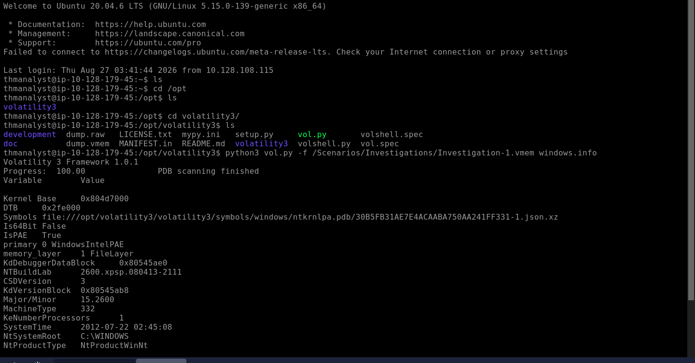
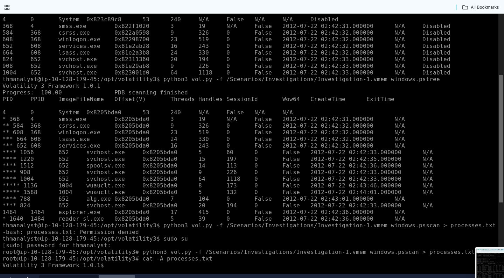
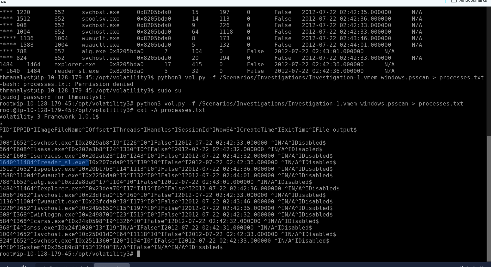
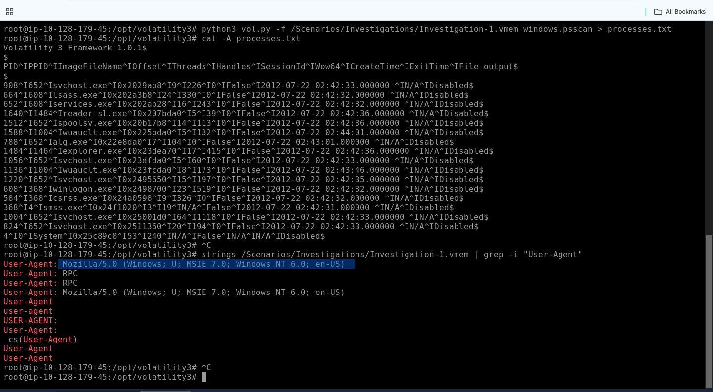
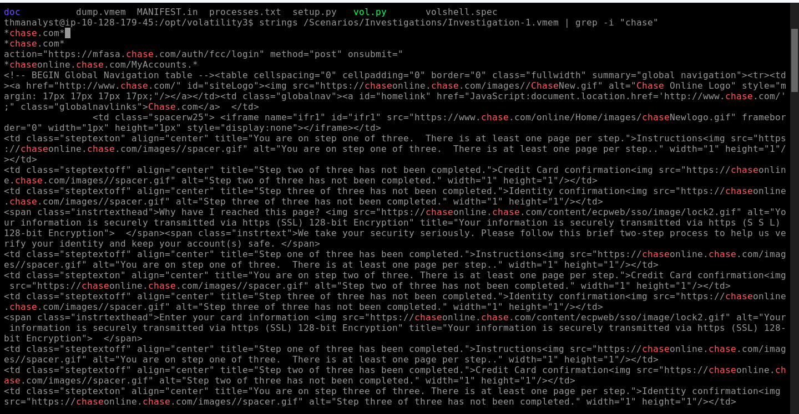
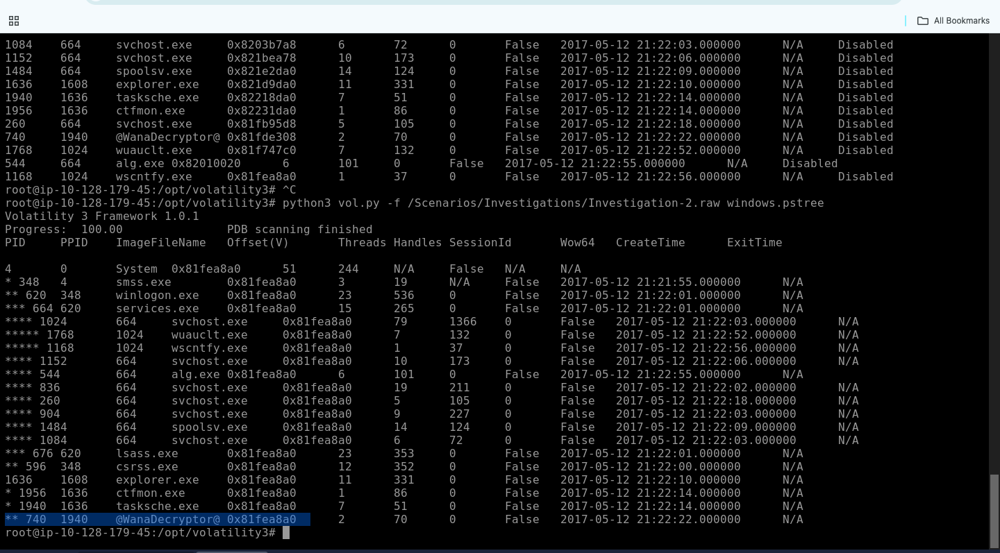
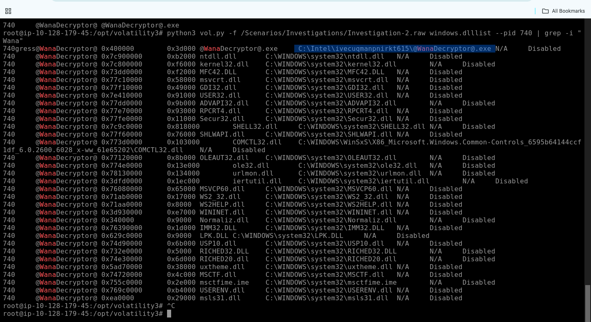
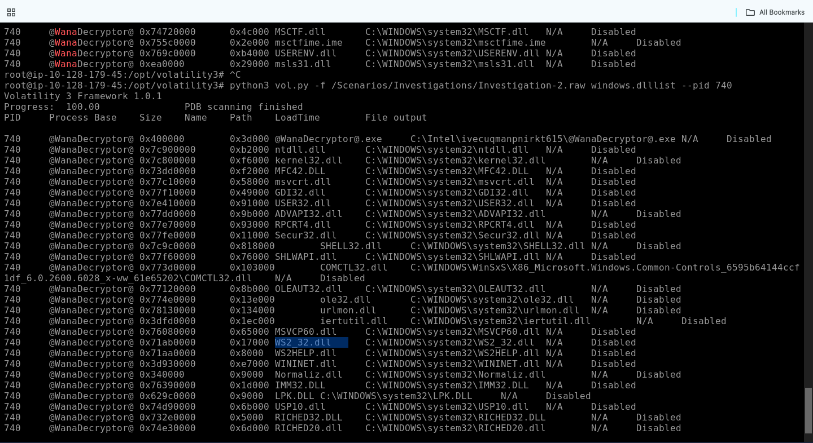
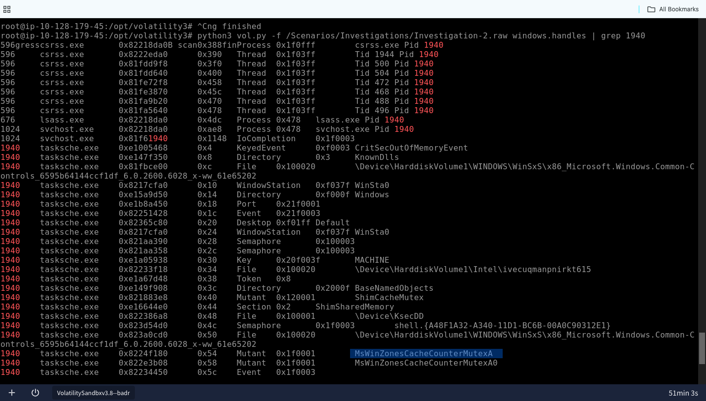

# Windows Memory Forensics — Banking Trojan and WannaCry Investigation

## Overview

This investigation involved analyzing two Windows memory captures associated with separate malware incidents.

Using **Volatility 3** and Linux command-line utilities, I examined operating-system information, reconstructed process relationships, validated suspicious processes, recovered strings from memory, identified banking-related content, analyzed ransomware components, and extracted memory-resident indicators.

The first case contained evidence consistent with a suspected banking Trojan operating under an Adobe-related process name. The second case contained high-confidence evidence of a WannaCry ransomware infection.

---

## Investigation Objectives

The objectives of this investigation were to:

* Identify the operating-system profile of each memory capture.
* Enumerate running and terminated processes.
* Reconstruct suspicious parent-child process relationships.
* Validate suspicious processes using multiple Volatility plugins.
* Recover network and application-related strings from memory.
* Identify evidence of banking credential-targeting activity.
* Investigate ransomware processes and executable paths.
* Examine loaded DLLs and process handles.
* Extract actionable memory-based indicators.
* Recommend appropriate incident-response actions.

---

## Evidence Sources

```text
/Scenarios/Investigations/Investigation-1.vmem
/Scenarios/Investigations/Investigation-2.raw
```

---

## Tools Used

* **Volatility 3** — Windows memory-forensics framework.
* **windows.info** — Identification of operating-system and memory-image information.
* **windows.pslist** — Enumeration of active processes.
* **windows.pstree** — Reconstruction of parent-child process relationships.
* **windows.psscan** — Scanning memory pools for active and terminated process objects.
* **windows.dlllist** — Identification of DLLs loaded by a process.
* **windows.handles** — Examination of process handles and mutexes.
* **strings** — Extraction of readable strings from raw memory.
* **grep** — Filtering recovered memory strings.
* **cat -A** — Displaying hidden characters inside command output.

The plugin names used in this investigation are documented in the [official Volatility 3 Windows plugin reference](https://volatility3.readthedocs.io/en/latest/volatility3.plugins.windows.html).

---

# Investigation

## Case 001 — Suspected Banking Trojan

### 1. Memory Image Profiling

I began by using the `windows.info` plugin to identify the operating-system information stored in the first memory capture.

```bash
python3 vol.py -f /Scenarios/Investigations/Investigation-1.vmem windows.info
```

The results included:

| Field                | Value                   |
| -------------------- | ----------------------- |
| NT Build String      | `2600.xpsp.080413-2111` |
| Architecture         | 32-bit                  |
| Captured System Time | `2012-07-22 02:45:08`   |
| System Root          | `C:\WINDOWS`            |



### Finding

The memory image contained a 32-bit Windows XP environment.

The `SystemTime` field represents the system clock stored in the captured memory. I treated it as the approximate capture time rather than claiming it was the exact time at which the acquisition process began.

---

### 2. Suspicious Process-Tree Analysis

I used `windows.pstree` to reconstruct the process hierarchy and identify unusual parent-child relationships.

```bash
python3 vol.py -f /Scenarios/Investigations/Investigation-1.vmem windows.pstree
```

The following process relationship was identified:

```text
explorer.exe
PID: 1484
    └── reader_sl.exe
        PID: 1640
```



The suspicious process was created at approximately:

```text
2012-07-22 02:42:36
```

### Finding

`reader_sl.exe` was launched as a child of `explorer.exe`, indicating execution within an interactive user session.

The process name resembles an Adobe Reader Speed Launcher component. Therefore, I did not classify it as malicious based solely on its name. Instead, I treated it as suspicious because of its relationship with the additional banking-related artifacts recovered from memory.

---

### 3. Process Validation with PSScan

I used `windows.psscan` to scan the memory pools and independently validate the process identified in the process tree.

```bash
python3 vol.py -f /Scenarios/Investigations/Investigation-1.vmem windows.psscan
```

The scan confirmed:

```text
Process: reader_sl.exe
PID:     1640
PPID:    1484
```



### Finding

The matching PID and parent PID across `windows.pstree` and `windows.psscan` confirmed that the process object was present in memory.

This correlation increased confidence in the process evidence but did not independently prove that the executable was malicious.

---

### 4. User-Agent String Recovery

I extracted readable strings from the memory image and filtered the results for user-agent values.

```bash
strings /Scenarios/Investigations/Investigation-1.vmem | grep -i "User-Agent"
```

The following user-agent was recovered:

```text
Mozilla/5.0 (Windows; U; MSIE 7.0; Windows NT 6.0; en-US)
```



### Finding

The memory image contained an Internet Explorer-style user-agent string.

However, the user-agent reports `Windows NT 6.0`, while the memory profile indicates Windows XP. This inconsistency suggests that the string may have been embedded, hard-coded, or spoofed.

I therefore treated it as a recovered contextual artifact rather than proof that Internet Explorer generated the activity.

---

### 5. Banking-Related Artifacts

I searched the memory image for references to the financial institution Chase.

```bash
strings /Scenarios/Investigations/Investigation-1.vmem | grep -i "chase"
```

The recovered strings contained references to:

```text
chase.com
chaseonline.chase.com
mfasa.chase.com/auth/fcc/login
Credit Card confirmation
Identity confirmation
```



The memory also contained HTML-style content associated with login and identity-verification pages.

### Finding

The recovered strings indicated that Chase-related authentication and credit-card content was present in the memory image.

When correlated with the suspicious process and the investigation scenario, the evidence was consistent with a banking credential-theft component.

The Chase domains are legitimate infrastructure and are not malicious Indicators of Compromise. They represent the financial brand targeted by the activity and should not be blocked based on these strings alone.

---

## Case 002 — WannaCry Ransomware

### 6. Ransomware Process-Tree Analysis

I analyzed the second memory capture using `windows.pstree`.

```bash
python3 vol.py -f /Scenarios/Investigations/Investigation-2.raw windows.pstree
```

The following process chain was identified:

```text
explorer.exe
PID: 1636
    └── tasksche.exe
        PID: 1940
            └── @WanaDecryptor@
                PID: 740
```



The process timestamps showed:

```text
tasksche.exe       — 2017-05-12 21:22:14
@WanaDecryptor@    — 2017-05-12 21:22:22
```

### Finding

`tasksche.exe` launched `@WanaDecryptor@` approximately eight seconds later.

The process name, execution sequence, and timing were consistent with WannaCry ransomware activity.

---

### 7. WannaCry Executable Path

I examined the process information and loaded-module output for PID `740`.

The full executable path was:

```text
C:\Intel\ivecuqmanpnirkt615\@WanaDecryptor@.exe
```



### Finding

The executable was running from an unusually named directory beneath `C:\Intel`.

The randomized-looking directory and distinctive `@WanaDecryptor@.exe` filename provided high-confidence evidence of a WannaCry ransomware component.

---

### 8. Winsock DLL Evidence

I used `windows.dlllist` to examine the modules loaded by PID `740`.

```bash
python3 vol.py -f /Scenarios/Investigations/Investigation-2.raw windows.dlllist --pid 740
```

The results showed that the process loaded:

```text
C:\WINDOWS\system32\WS2_32.dll
```



### Finding

`WS2_32.dll` is a legitimate Windows Winsock library used by applications for network communication.

Its presence demonstrated that the ransomware process had loaded Windows networking functionality. However, a loaded DLL alone does not prove that a successful external network connection occurred.

---

### 9. WannaCry-Associated Mutex

I examined the process handles connected to the WannaCry process chain.

```bash
python3 vol.py -f /Scenarios/Investigations/Investigation-2.raw windows.handles | grep 1940
```

The following mutex was identified:

```text
MsWinZonesCacheCounterMutexA
```



### Finding

The mutex provided an additional WannaCry-associated memory indicator in this case.

Mutexes are commonly used by malware to coordinate execution and prevent multiple copies of the same component from running simultaneously.

---

# Key Findings

| Category                  | Finding                                                     |
| ------------------------- | ----------------------------------------------------------- |
| Case 001 Memory Image     | `Investigation-1.vmem`                                      |
| Case 001 Operating System | Windows XP, 32-bit                                          |
| Captured System Time      | `2012-07-22 02:45:08`                                       |
| Suspicious Process        | `reader_sl.exe`                                             |
| Suspicious PID            | `1640`                                                      |
| Parent Process            | `explorer.exe`                                              |
| Parent PID                | `1484`                                                      |
| Recovered User-Agent      | `Mozilla/5.0 (Windows; U; MSIE 7.0; Windows NT 6.0; en-US)` |
| Targeted Financial Brand  | Chase                                                       |
| Scenario-Provided IP      | `41.168.5.140`                                              |
| Case 002 Memory Image     | `Investigation-2.raw`                                       |
| Ransomware Family         | WannaCry                                                    |
| Ransomware Process        | `@WanaDecryptor@`                                           |
| Ransomware PID            | `740`                                                       |
| Parent Process            | `tasksche.exe`                                              |
| Parent PID                | `1940`                                                      |
| Executable Path           | `C:\Intel\ivecuqmanpnirkt615\@WanaDecryptor@.exe`           |
| Loaded Networking DLL     | `WS2_32.dll`                                                |
| Associated Mutex          | `MsWinZonesCacheCounterMutexA`                              |

---

# Indicators and Investigative Artifacts

## High-Confidence Malicious Indicators

```text
@WanaDecryptor@
C:\Intel\ivecuqmanpnirkt615\@WanaDecryptor@.exe
MsWinZonesCacheCounterMutexA
```

## Context-Dependent Investigative Leads

```text
reader_sl.exe
tasksche.exe
41.168.5.140
```

The IP address `41.168.5.140` was supplied by the investigation scenario as a suspicious lead. It was not independently confirmed through retained network evidence in this report.

The process names `reader_sl.exe` and `tasksche.exe` should be correlated with their paths, hashes, signatures, parent processes, and surrounding activity before being used as standalone detection indicators.

## Contextual Artifacts — Not Blocklist IOCs

```text
chase.com
chaseonline.chase.com
mfasa.chase.com/auth/fcc/login
Mozilla/5.0 (Windows; U; MSIE 7.0; Windows NT 6.0; en-US)
WS2_32.dll
```

The Chase domains and `WS2_32.dll` are legitimate. Their presence provided investigative context but does not make them malicious.

---

# MITRE ATT&CK Mapping

| Technique                 | ID                                                  | Evidence                                                                                                                                |
| ------------------------- | --------------------------------------------------- | --------------------------------------------------------------------------------------------------------------------------------------- |
| Data Encrypted for Impact | [T1486](https://attack.mitre.org/techniques/T1486/) | The second memory capture contained the WannaCry decryptor process, its executable path, supporting process chain, and associated mutex |

I limited the ATT&CK mapping to behavior that could be reasonably supported by the retained memory evidence. I excluded speculative masquerading and network-communication techniques because the available screenshots did not prove them conclusively.

---

# SOC Assessment

## Case 001

**Verdict:** True Positive in the lab context
**Analyst-assessed Severity:** High

The assessment was based on the correlation of:

* A scenario-identified suspicious process.
* Consistent PID and PPID results across multiple Volatility plugins.
* Banking authentication and credit-card page artifacts recovered from memory.
* An Internet Explorer-style user-agent string.
* The scenario-provided suspicious IP address.

In a production investigation, I would require the executable path, hash, digital-signature information, disk evidence, and network telemetry before making definitive malware-family attribution.

## Case 002

**Verdict:** True Positive
**Analyst-assessed Severity:** Critical

The second case contained high-confidence evidence of a WannaCry ransomware infection:

* `@WanaDecryptor@` was present in the process tree.
* The process was launched by `tasksche.exe`.
* The executable ran from an unusual directory.
* The process loaded Windows networking functionality.
* A WannaCry-associated mutex was present in memory.

The incident should be escalated immediately because ransomware activity can cause widespread encryption, operational disruption, and propagation to additional vulnerable systems.

---

# Evidence Limitations

The investigation was based primarily on volatile-memory evidence.

No disk image, packet capture, executable hashes, or endpoint-detection telemetry were included in the retained evidence set. Therefore:

* File execution was assessed using memory-resident processes and process relationships.
* Network capability was inferred from loaded modules, not confirmed network connections.
* Case 001 malware attribution depended partly on the investigation scenario.
* Legitimate domains and DLLs were treated as contextual evidence rather than malicious indicators.
* Additional disk and network evidence would be required to reconstruct the complete attack chain.

---

# Recommended Response Actions

If these findings were identified in a production environment, I would recommend:

1. **Immediately isolate the affected systems** to prevent additional communication, encryption, or propagation.
2. **Preserve the memory captures and acquire forensic disk images** before remediation.
3. **Recover and hash the suspicious executables** for malware analysis and threat-intelligence enrichment.
4. **Verify digital signatures and file locations** for `reader_sl.exe` and `tasksche.exe`.
5. **Search enterprise telemetry** for the WannaCry executable path, process name, parent process, and mutex.
6. **Review proxy, DNS, firewall, and endpoint logs** for communication involving the scenario-provided suspicious IP.
7. **Reset credentials potentially exposed through banking credential-theft activity.**
8. **Do not block the legitimate Chase domains** based solely on their presence in memory.
9. **Check other systems for SMB-based propagation** and related WannaCry activity.
10. **Verify and apply Microsoft security update MS17-010** to vulnerable systems.
11. **Disable SMBv1 where it is not operationally required**, consistent with [CISA’s WannaCry guidance](https://www.cisa.gov/news-events/alerts/2017/05/12/indicators-associated-wannacry-ransomware).
12. **Restore encrypted systems from verified clean backups** after containment and eradication.
13. **Conduct an enterprise-wide compromise assessment** before returning affected systems to production.

---

# Conclusion

This investigation demonstrated how volatile-memory evidence can be used to identify suspicious processes, reconstruct process relationships, recover application and network-related artifacts, and detect ransomware activity.

In Case 001, I correlated process evidence with banking-related strings and contextual indicators consistent with a suspected banking credential-theft component. I avoided classifying legitimate financial domains or a generic user-agent as malicious IOCs.

In Case 002, I identified a WannaCry process chain, recovered the ransomware executable path, examined its loaded networking library, and identified an associated mutex.

The combined evidence supported classification of both cases as security incidents, with the WannaCry infection representing the more severe and immediately actionable compromise.

## Skills Demonstrated

* Windows memory-forensics analysis
* Volatility 3 plugin usage
* Memory-image profiling
* Process enumeration and validation
* Parent-child process correlation
* Memory-pool scanning
* Process DLL analysis
* Handle and mutex analysis
* String extraction and filtering
* Malware process identification
* Ransomware investigation
* IOC classification
* Evidence-confidence assessment
* MITRE ATT&CK mapping
* SOC incident assessment
* Incident-response recommendations

---

> **Lab Environment:** This investigation was completed in the TryHackMe *Volatility* cybersecurity training environment. All memory images, indicators, systems, and malware artifacts referenced in this report are part of the authorized lab scenario.

